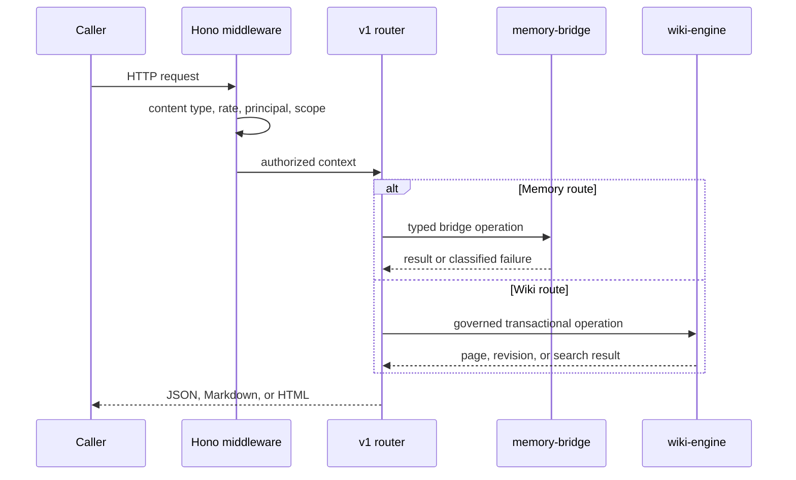
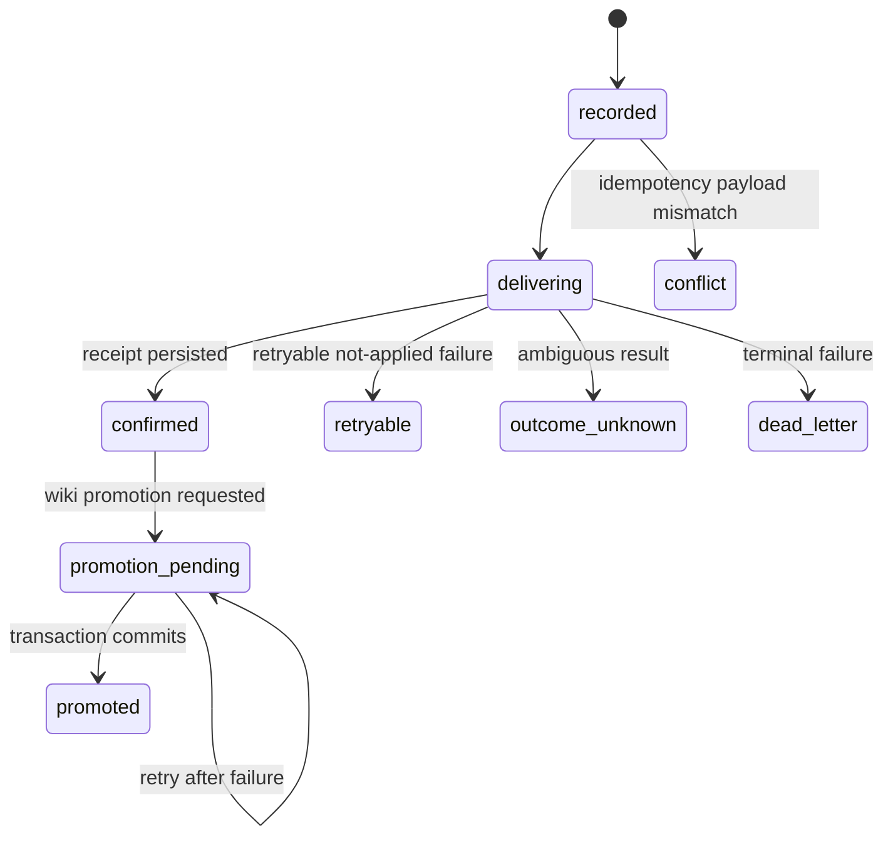

# API

Active contributors: Rom Iluz

## Purpose

The API is MDBrain's central runtime. It exposes a Hono HTTP surface for memory, lifecycle, wiki, and delivery-administration operations while enforcing transport checks, rate limits, bearer authentication, scoped authorization, and governed wiki access.

Endpoint-level request and response documentation belongs in [API](../api/). The memory and wiki implementations are covered in [Packages](../packages/), while [Architecture](../overview/architecture.md) explains the service boundary.

## Directory layout

```text
apps/api/
├── src/
│   ├── server.ts                   Node server and shutdown orchestration
│   ├── app.ts                      Hono composition, middleware, and probes
│   ├── routes/v1.ts                Versioned product routes
│   ├── principal.ts                API-key principal and authorization model
│   ├── api-context.ts              Typed Hono request context
│   ├── memory-delivery-runtime.ts  Durable write and promotion reconciler
│   ├── wiki-store-runtime.ts       Wiki store lifecycle and transactions
│   ├── openapi-spec.ts             OpenAPI 3.0 document
│   └── lib/errors.ts               Redacted JSON error responses
├── package.json
└── wrangler.jsonc
```

## Key abstractions

| Abstraction | Path | Responsibility |
| --- | --- | --- |
| `createApp` | `apps/api/src/app.ts` | Constructs the Hono app, middleware stack, health routes, readiness checks, and v1 router |
| `ApiPrincipal` | `apps/api/src/principal.ts` | Carries subject identity, groups, roles, departments, trust tier, scope grants, agent grants, and capabilities |
| `authorizePrincipalRequest` | `apps/api/src/principal.ts` | Rejects stale identities and requests outside a principal's agent, scope, scope-ref, or capability grants |
| `createV1Router` | `apps/api/src/routes/v1.ts` | Validates inputs and dispatches all `/v1` operations |
| `deliverMemoryWrite` | `apps/api/src/memory-delivery-runtime.ts` | Records a durable intent, dispatches a Memongo write, persists its receipt, and optionally promotes it to the wiki |
| `startMemoryDeliveryReconciler` | `apps/api/src/memory-delivery-runtime.ts` | Retries eligible delivery and promotion states with bounded exponential delays |
| `WikiStore` runtime wrapper | `apps/api/src/wiki-store-runtime.ts` | Lazily initializes the wiki store and exposes transaction and readiness helpers |
| `openApiSpec` | `apps/api/src/openapi-spec.ts` | Describes the public HTTP contract served at `/openapi.json` |

## Request flow

`createApp` in `apps/api/src/app.ts` applies middleware in a deliberate order:

1. CORS uses `MDBRAIN_API_CORS_ORIGINS` when configured.
2. Non-GET `/v1` requests with a body must use `application/json`.
3. An in-memory, per-IP sliding-window limiter applies to `/v1`.
4. Bearer authentication resolves either the administrator key or a policy from `MDBRAIN_API_SCOPED_KEYS`.
5. Authorization derives the required capability from the route and extracts `agentId`, `scope`, and `scopeRef` from the request.
6. `createV1Router` validates the operation and calls the memory bridge or wiki engine.
7. `jsonError` in `apps/api/src/lib/errors.ts` redacts secrets before an error reaches the caller.



## Route families

The route implementation in `apps/api/src/routes/v1.ts` contains 32 handlers.

| Family | Routes | Behavior |
| --- | --- | --- |
| Service | `GET /health`, `GET /ready`, `GET /openapi.json` | Reports process health, checks Memongo plus transactional wiki readiness with a one-second cache, and serves the contract |
| Recall and context | `/v1/search`, `/v1/search-kb`, `/v1/recall-conversation`, `/v1/search-detailed`, `/v1/hydrate-active-slate`, `/v1/discovery-projection`, `/v1/context-bundle`, `/v1/profile`, `/v1/state` | Reads memory through `@mdbrain/memory-bridge` |
| Memory lifecycle | `/v1/lifecycle/get`, `/v1/lifecycle/update`, `/v1/lifecycle/delete`, `/v1/lifecycle/history`, `/v1/procedures/outcome`, `/v1/memory/feedback` | Uses stable handles and revision-aware update or invalidation semantics |
| Memory writes | `/v1/add`, `/v1/write-event`, `/v1/extract`, `/v1/write-structured`, `/v1/write-procedure` | Writes through the bridge; event-producing writes require caller-provided idempotency |
| Wiki | `/v1/wiki`, `/v1/wiki/*`, `/v1/wiki/search`, `/v1/wiki/lint`, revision routes, and OKF import/export | Runs governed reads and transactional mutations through `@mdbrain/wiki-engine` |
| Administration | `GET /v1/admin/deliveries` | Returns redacted durable-delivery records without payloads or idempotency keys |

The router is the executable contract. `apps/api/src/openapi-spec.ts` must remain aligned with it, and detailed endpoint guidance should be updated in [API](../api/) rather than duplicated here.

## Durable memory delivery

`POST /v1/add` and `POST /v1/write-event` pass through `deliverMemoryWrite` in `apps/api/src/memory-delivery-runtime.ts`. The runtime hashes the principal, scope, operation, and caller idempotency key into an operation ID, records the intent in the wiki database, dispatches to Memongo, then confirms the receipt. An explicit `promotionPolicy: "wiki"` adds a receipt-gated wiki page mutation in a transaction.



`startMemoryDeliveryReconciler` revisits `recorded`, `delivering`, `retryable`, `outcome-unknown`, and `promotion-pending` intents. It reuses the original idempotency key and caps its retry delay at 60 seconds. See the related write and promotion behavior under [Features](../features/).

## Authentication and readiness

`apps/api/src/principal.ts` supports one unrestricted administrator token through `MDBRAIN_API_KEY` and multiple constrained policies through `MDBRAIN_API_SCOPED_KEYS`. Capabilities include `read`, `write`, `administer`, `change-permissions`, `hard-delete`, `export`, and `manage-connectors`. Production startup fails if neither key source is configured; trusted development receives a standard-tier in-process principal and a warning.

`GET /ready` checks the pinned Memongo contract and the wiki store in parallel. The wiki check pings MongoDB and performs a transaction, so a nominal connection without transaction support is not considered ready.

## Integration points

- `@mdbrain/memory-bridge` owns remote Memongo compatibility, request policy, and typed memory operations. See [Memory bridge](../packages/memory-bridge.md).
- `@mdbrain/wiki-engine` owns wiki persistence, governance, search, revisions, mutation intents, and delivery intents. See [Wiki engine](../packages/wiki-engine/).
- `@mdbrain/lib` supplies shared scope types and secret redaction.
- [MCP](mcp.md), [Web](web.md), and external clients call this application through HTTP rather than importing its internals.
- Cloudflare settings live in `apps/api/wrangler.jsonc`; runtime setup is documented in [Deployment](../deployment/).

## Entry points for modification

Start in `apps/api/src/routes/v1.ts` for product behavior, input validation, or route wiring. Add cross-cutting request policy in `apps/api/src/app.ts`, principal semantics in `apps/api/src/principal.ts`, and durable delivery transitions in `apps/api/src/memory-delivery-runtime.ts`.

For every route change, update `apps/api/src/openapi-spec.ts` and the relevant tests. Keep database ownership in `@mdbrain/wiki-engine` and Memongo transport ownership in `@mdbrain/memory-bridge` instead of adding persistence logic to the router.

## Key source files

| File | Purpose |
| --- | --- |
| `apps/api/src/server.ts` | Starts the HTTP server and reconciler, then drains both on `SIGTERM` or `SIGINT` |
| `apps/api/src/app.ts` | Composes middleware, authentication, probes, and routing |
| `apps/api/src/routes/v1.ts` | Implements all versioned HTTP operations |
| `apps/api/src/principal.ts` | Parses API-key policies and authorizes principal requests |
| `apps/api/src/api-context.ts` | Defines typed principal and authorized-scope request variables |
| `apps/api/src/memory-delivery-runtime.ts` | Implements durable Memongo delivery and receipt-gated wiki promotion |
| `apps/api/src/wiki-store-runtime.ts` | Manages the singleton wiki store and transaction boundary |
| `apps/api/src/openapi-spec.ts` | Defines the OpenAPI document |
| `apps/api/src/lib/errors.ts` | Produces secret-redacted JSON errors |
| `apps/api/src/app.test.ts` | Covers application middleware and service behavior |
| `apps/api/src/principal.test.ts` | Covers policy parsing and authorization |
| `apps/api/src/memory-delivery-runtime.test.ts` | Covers delivery state transitions and reconciliation |
| `apps/api/src/wiki-routes.test.ts` | Covers governed wiki HTTP behavior |
