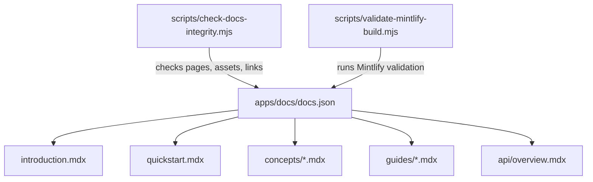

# Docs

Active contributors: Rom Iluz

## Purpose

The docs application is MDBrain's static Mintlify site. Its MDX pages cover setup, concepts, integration policy, MCP usage, configuration, open-source boundaries, and a compact HTTP endpoint overview.

The site explains the public product surface but does not implement runtime behavior. Follow links to [Applications](index.md), [Packages](../packages/), [Features](../features/), [API](../api/), and [Deployment](../deployment/) when implementation detail is needed.

## Directory layout

```text
apps/docs/
├── docs.json
├── introduction.mdx
├── quickstart.mdx
├── api/
│   └── overview.mdx
├── concepts/
│   ├── framework.mdx
│   ├── memory-taxonomy.mdx
│   ├── memory.mdx
│   └── architecture.mdx
├── guides/
│   ├── company-brain.mdx
│   ├── writeback-policy.mdx
│   ├── adapters.mdx
│   ├── cli-memory.mdx
│   ├── memory-config.mdx
│   └── open-source.mdx
├── logo/
├── favicon.png
└── package.json
```

## Key abstractions

| Abstraction | Path | Responsibility |
| --- | --- | --- |
| Mintlify site configuration | `apps/docs/docs.json` | Sets branding, navigation tabs, page groups, redirects, icons, and theme |
| Introduction | `apps/docs/introduction.mdx` | Defines MDBrain's public framing and links readers into the main guides |
| Quickstart | `apps/docs/quickstart.mdx` | Walks through MongoDB, Memongo, API startup, verification, and an add/search loop |
| Framework contract | `apps/docs/concepts/framework.mdx` | Defines operations, scopes, safety, and the Company Brain model |
| Memory taxonomy | `apps/docs/concepts/memory-taxonomy.mdx` | Maps memory types, operation intent, retrieval lanes, provenance, and scope |
| Adapter contract | `apps/docs/guides/adapters.mdx` | Defines thin, read-first integration behavior and client-specific MCP guidance |
| Writeback policy | `apps/docs/guides/writeback-policy.mdx` | Separates safe reads from explicit writes, corrections, and invalidation |
| Docs integrity checker | `scripts/check-docs-integrity.mjs` | Verifies configured pages, assets, redirects, and internal links |
| Mintlify validation wrapper | `scripts/validate-mintlify-build.mjs` | Runs `mintlify validate` and fails on known runtime-error text even if the command exits successfully |

## Navigation and content flow

`apps/docs/docs.json` defines two top-level tabs:

- **Documentation** groups the introduction and quickstart, concepts, Company Brain guides, MCP guidance, and configuration.
- **API Reference** links to `apps/docs/api/overview.mdx`.

The root redirects to `/introduction`. Each page carries MDX frontmatter for its title, description, and icon, then uses Mintlify components such as `Card`, `CardGroup`, and `Tabs` where useful.



## Build checks

The `build` script in `apps/docs/package.json` runs `scripts/check-docs-integrity.mjs`. That script traverses every MDX file, checks that navigation and redirect destinations exist, verifies logo and favicon paths, validates local Markdown and `href` links, and writes `apps/docs/.turbo/docs-integrity.txt`.

The separate `validate:mintlify` script runs `scripts/validate-mintlify-build.mjs`. Besides honoring the Mintlify process exit status, the wrapper rejects known runtime error messages so documentation validation cannot report a false success.

## Integration points

- `apps/docs/quickstart.mdx` connects the local MongoDB, Memongo, API, web, and MCP startup paths.
- `apps/docs/concepts/architecture.mdx` summarizes application and package boundaries; the deeper design is in [Architecture](../overview/architecture.md).
- `apps/docs/api/overview.mdx` is the reader-oriented endpoint summary. The generated contract and route details belong in [API](../api/).
- `apps/docs/guides/cli-memory.mdx` and `apps/docs/guides/adapters.mdx` describe the [MCP application](mcp.md).
- `apps/docs/guides/memory-config.mdx` documents runtime variables whose deployment context is covered in [Deployment](../deployment/).
- `apps/docs/guides/open-source.mdx` maps public applications, packages, Docker support, workflows, and release scripts.

## Entry points for modification

Edit the matching MDX page for prose or examples, and update `apps/docs/docs.json` whenever a page is added, moved, or removed from navigation. Keep conceptual docs aligned with [Features](../features/) and package pages rather than reproducing implementation internals.

Run the package build after link or navigation changes, and run Mintlify validation before release. When an API route changes, update `apps/docs/api/overview.mdx` together with the executable route and OpenAPI contract.

## Key source files

| File | Purpose |
| --- | --- |
| `apps/docs/docs.json` | Mintlify branding and navigation |
| `apps/docs/introduction.mdx` | Product introduction and primary links |
| `apps/docs/quickstart.mdx` | Local setup and first add/search example |
| `apps/docs/api/overview.mdx` | Human-readable HTTP endpoint overview |
| `apps/docs/concepts/architecture.mdx` | Runtime and package boundary summary |
| `apps/docs/concepts/framework.mdx` | Company Brain framework contract |
| `apps/docs/concepts/memory-taxonomy.mdx` | Canonical memory types and operations |
| `apps/docs/concepts/memory.mdx` | MongoDB storage and retrieval concepts |
| `apps/docs/guides/company-brain.mdx` | Adoption and scope guidance |
| `apps/docs/guides/writeback-policy.mdx` | Read-first and explicit-write policy |
| `apps/docs/guides/adapters.mdx` | Adapter rules and client templates |
| `apps/docs/guides/cli-memory.mdx` | MCP startup and primary tool guidance |
| `apps/docs/guides/memory-config.mdx` | Runtime environment variables |
| `apps/docs/guides/open-source.mdx` | Public repository support map |
| `scripts/check-docs-integrity.mjs` | Docs structure and local-link validation |
| `scripts/validate-mintlify-build.mjs` | Mintlify validation release gate |
