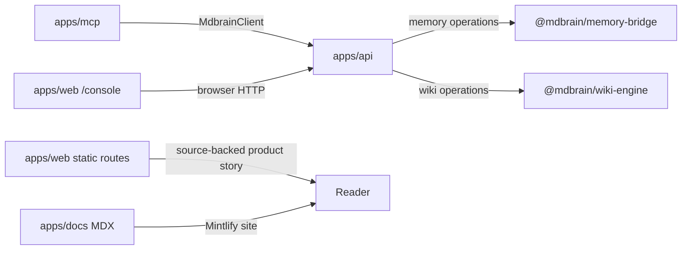

# Applications

Active contributors: Rom Iluz

## Purpose

MDBrain ships four runnable surfaces around the same memory and wiki platform: the central HTTP API, a stdio MCP adapter, a Next.js web application, and a Mintlify documentation site. The API owns runtime orchestration; the other applications either call it, explain it, or provide a user interface over it.

For the system-wide boundaries behind these applications, start with [Architecture](../overview/architecture.md). Package internals are covered under [Packages](../packages/), cross-application behavior under [Features](../features/), endpoint contracts under [API](../api/), and hosting details under [Deployment](../deployment/).

## Directory layout

```text
apps/
├── api/   Hono HTTP API and delivery reconciler
├── mcp/   MCP server over stdio
├── web/   Next.js marketing site, demos, and live console
└── docs/  Mintlify MDX documentation
```

## Application map

| Application | Runtime boundary | Primary entry point | Role |
| --- | --- | --- | --- |
| [API](api.md) | Node.js HTTP server; Cloudflare Workers configuration is also present | `apps/api/src/server.ts` | Authenticates requests, exposes health and v1 routes, coordinates memory and wiki work, and reconciles durable writes |
| [MCP](mcp.md) | MCP over process stdin/stdout | `apps/mcp/src/server.ts` | Publishes 30 tools backed by `@mdbrain/client` |
| [Web](web.md) | Next.js 15 and React 19, deployed through OpenNext | `apps/web/app/layout.tsx` | Hosts static product pages, an interactive retrieval demo, comparisons, and a browser-side API console |
| [Docs](docs.md) | Mintlify static MDX site | `apps/docs/docs.json` | Publishes conceptual, setup, integration, and HTTP API documentation |

## Key abstractions

| Abstraction | Path | Responsibility |
| --- | --- | --- |
| `createApp` | `apps/api/src/app.ts` | Composes the Hono application and its middleware |
| `createV1Router` | `apps/api/src/routes/v1.ts` | Implements the memory, lifecycle, wiki, and administration routes |
| `toolList` | `apps/mcp/src/server.ts` | Declares the MCP tool catalog and JSON schemas |
| `RootLayout` | `apps/web/app/layout.tsx` | Establishes global metadata and the web application shell |
| Mintlify navigation | `apps/docs/docs.json` | Defines docs branding, tabs, groups, redirects, and page order |

## How it works



The API is the only application that calls the memory bridge and wiki engine directly. The MCP server and live console use `@mdbrain/client`, while the marketing and documentation routes are static content surfaces.

## Integration points

- `apps/api/package.json` depends on `@mdbrain/lib`, `@mdbrain/memory-bridge`, and `@mdbrain/wiki-engine`.
- `apps/mcp/package.json` depends on `@mdbrain/client` and the Model Context Protocol SDK.
- `apps/web/package.json` depends on `@mdbrain/client` for the live console and uses OpenNext for Cloudflare deployment.
- `apps/docs/package.json` uses Mintlify and repository scripts for integrity and validation checks.

## Entry points for modification

Choose the application by deployment boundary. Change request behavior in `apps/api/src/app.ts` or `apps/api/src/routes/v1.ts`, agent tool exposure in `apps/mcp/src/server.ts`, web routes under `apps/web/app/`, and documentation navigation or prose under `apps/docs/`.

When a change crosses an application boundary, update the shared package first and keep each app as a thin adapter. Check [Deployment](../deployment/) before changing runtime configuration.

## Key source files

| File | Purpose |
| --- | --- |
| `apps/api/src/server.ts` | Starts the API and delivery reconciler |
| `apps/api/src/app.ts` | Builds the Hono application |
| `apps/mcp/src/server.ts` | Defines and runs the stdio MCP server |
| `apps/web/app/layout.tsx` | Defines the Next.js root layout and metadata |
| `apps/web/app/page.tsx` | Renders the main marketing page |
| `apps/docs/docs.json` | Configures the Mintlify site |
