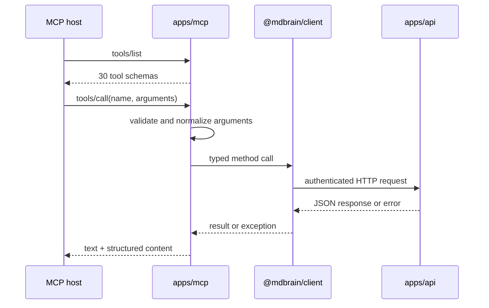

# MCP

Active contributors: Rom Iluz

## Purpose

The MCP application exposes MDBrain to MCP-compatible hosts over stdin/stdout. It is a thin adapter: every tool validates or normalizes its arguments, calls `MdbrainClient`, and serializes the HTTP result back into MCP content.

The MCP process does not connect to MongoDB or Memongo directly. Those boundaries remain in the [API application](api.md) and the packages described under [Packages](../packages/); [Architecture](../overview/architecture.md) shows the complete call path.

## Directory layout

```text
apps/mcp/
├── src/
│   ├── server.ts       tool catalog, dispatch, and stdio startup
│   └── server.test.ts  schema and dispatch coverage
├── package.json
└── wrangler.jsonc
```

## Key abstractions

| Abstraction | Path | Responsibility |
| --- | --- | --- |
| `MdbrainClient` instance | `apps/mcp/src/server.ts` | Reads `MDBRAIN_API_URL` and `MDBRAIN_API_KEY` and sends all operations to the API |
| `toolList` | `apps/mcp/src/server.ts` | Defines 30 MCP tools with names, descriptions, and input schemas |
| `handleToolCall` | `apps/mcp/src/server.ts` | Dispatches a tool name to the corresponding client method and marks failures as MCP errors |
| Alias sets | `apps/mcp/src/server.ts` | Maps lifecycle names and memory-oriented aliases to the same client operations |
| `jsonResult` | `apps/mcp/src/server.ts` | Returns both text content and structured content when the payload permits it |
| `main` | `apps/mcp/src/server.ts` | Connects the SDK `Server` to `StdioServerTransport` |

## Tool catalog

`toolList` in `apps/mcp/src/server.ts` defines exactly 30 tools.

| Area | Tools |
| --- | --- |
| Search and context | `mdbrain_search`, `mdbrain_search_kb`, `mdbrain_search_detailed`, `mdbrain_recall_conversation`, `mdbrain_recall_messages`, `mdbrain_build_context_bundle`, `mdbrain_hydrate_active_slate`, `mdbrain_discovery_projection`, `mdbrain_profile`, `mdbrain_state_unified` |
| Writes and feedback | `mdbrain_add`, `mdbrain_write_event`, `mdbrain_write_structured`, `mdbrain_write_procedure`, `mdbrain_procedure_outcome`, `mdbrain_memory_feedback` |
| Lifecycle | `mdbrain_lifecycle_get`, `mdbrain_memory_get`, `mdbrain_lifecycle_update`, `mdbrain_memory_update`, `mdbrain_lifecycle_delete`, `mdbrain_memory_delete`, `mdbrain_lifecycle_history`, `mdbrain_memory_history` |
| Wiki | `mdbrain_wiki_search`, `mdbrain_wiki_get`, `mdbrain_wiki_apply`, `mdbrain_wiki_export_okf`, `mdbrain_wiki_import_okf`, `mdbrain_wiki_lint` |

The `mdbrain_memory_*` lifecycle tools and `mdbrain_recall_messages` are semantic aliases. They reach the same client methods as their lifecycle or conversation counterparts, so they do not create separate runtime behavior.

## How it works



The server registers handlers for `ListToolsRequestSchema` and `CallToolRequestSchema` from the MCP SDK in `apps/mcp/src/server.ts`. Unknown tools and thrown client errors become `{ isError: true }` results instead of crashing the stdio process.

The module starts only when `import.meta.url` matches the invoked entry point. This keeps `handleToolCall` and `toolList` importable by `apps/mcp/src/server.test.ts` without opening a transport.

## Integration points

- `@mdbrain/client`, documented under [Packages](../packages/), is the sole product client used by the adapter.
- The [API application](api.md) performs authentication, authorization, idempotency, governance, persistence, and upstream error classification.
- `MDBRAIN_API_URL` selects the API base URL and `MDBRAIN_API_KEY` supplies its bearer token.
- `apps/mcp/package.json` runs the TypeScript entry point with Node and `tsx`.
- `apps/mcp/wrangler.jsonc` records a Workers-compatible build target, but the implemented transport is process stdio.
- Read-first and writeback behavior is discussed under [Features](../features/), while runtime setup belongs in [Deployment](../deployment/).

## Entry points for modification

Add or change an MCP tool in both `toolList` and `handleToolCall` within `apps/mcp/src/server.ts`. Prefer adding the corresponding typed operation to `@mdbrain/client` first; the adapter should not duplicate URL construction or HTTP policy.

Update `apps/mcp/src/server.test.ts` whenever a schema, alias, validation rule, or result shape changes. Changes to the public HTTP contract should be documented under [API](../api/) rather than encoded only in the MCP description.

## Key source files

| File | Purpose |
| --- | --- |
| `apps/mcp/src/server.ts` | Declares all tools, dispatches calls, and starts the stdio transport |
| `apps/mcp/src/server.test.ts` | Verifies the tool catalog and client-backed dispatch |
| `apps/mcp/package.json` | Defines start, build, type-check, and test commands |
| `apps/mcp/wrangler.jsonc` | Declares the Cloudflare-compatible application target and observability setting |
