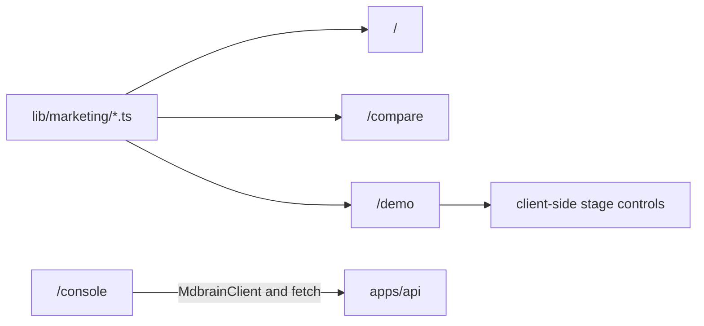

# Web

Active contributors: Rom Iluz

## Purpose

The web application combines a static product site with one live browser-side console. The home, comparison, and retrieval-autopsy routes explain MDBrain with source-backed static data; `/console` constructs `@mdbrain/client` in the browser and calls a configured API.

The application uses the Next.js App Router, React 19, and OpenNext for Cloudflare. System internals belong in [Architecture](../overview/architecture.md), [Packages](../packages/), and [Features](../features/) rather than in the marketing components.

## Directory layout

```text
apps/web/
├── app/
│   ├── layout.tsx                 global metadata and HTML shell
│   ├── page.tsx                   Living System Atlas landing page
│   ├── compare/page.tsx           sourced market field guide
│   ├── demo/page.tsx              retrieval-autopsy route
│   ├── demo/components/           interactive demo stages and result views
│   ├── console/page.tsx           live client-side API console
│   ├── console/overview.ts        health and OpenAPI summary loader
│   └── components/                landing-page interactions
├── lib/marketing/
│   ├── architecture.ts            architecture and proof-scenario content
│   ├── comparisons.ts             category and named comparisons
│   └── demo-scenario.ts           deterministic synthetic demo data
├── e2e/showcase.e2e.ts
├── next.config.ts
├── open-next.config.ts
└── wrangler.jsonc
```

## Routes

| Route | Rendering and purpose | Main source |
| --- | --- | --- |
| `/` | Static marketing page with an interactive system atlas, proof scenarios, capability comparison, evidence ledger, and quickstart | `apps/web/app/page.tsx` |
| `/compare` | Static, first-party-sourced field guide comparing company-context, agent-memory, and open-knowledge products | `apps/web/app/compare/page.tsx` |
| `/demo` | Static shell around a five-stage client-side retrieval autopsy using deterministic synthetic records | `apps/web/app/demo/page.tsx` |
| `/console` | Client component that accepts API connection settings and runs live health, search, profile, write, and wiki operations | `apps/web/app/console/page.tsx` |

## Key abstractions

| Abstraction | Path | Responsibility |
| --- | --- | --- |
| `RootLayout` | `apps/web/app/layout.tsx` | Sets global metadata, social cards, language, and the root body |
| `SystemAtlas` | `apps/web/app/components/system-atlas.tsx` | Lets readers inspect six architecture stages from source material to delivered context |
| `ScenarioExplorer` | `apps/web/app/components/scenario-explorer.tsx` | Presents keyboard-accessible proof-scenario tabs |
| `RetrievalAutopsy` | `apps/web/app/demo/components/retrieval-autopsy.tsx` | Drives the Ask, Fail, Autopsy, Retrieve, and Trust stages |
| `ResultStack` | `apps/web/app/demo/components/result-stack.tsx` | Compares unexamined similarity ranking with governed dispositions |
| `ContextBundle` | `apps/web/app/demo/components/context-bundle.tsx` | Toggles the synthetic result between a human-readable answer and representative JSON |
| `demoScenario` | `apps/web/lib/marketing/demo-scenario.ts` | Holds the deterministic Northstar Systems corpus, pipeline, answer, and source links |
| `MdbrainClient` usage | `apps/web/app/console/page.tsx` | Runs live memory and wiki requests from the browser |
| `loadOverview` | `apps/web/app/console/overview.ts` | Fetches `/health` and `/openapi.json` and counts documented operations |

## Static story and live console

The marketing routes keep their claims in typed modules under `apps/web/lib/marketing/`. `apps/web/lib/marketing/architecture.ts` supplies the six-stage system narrative and five proof scenarios. `apps/web/lib/marketing/comparisons.ts` supplies the capability matrix and dated first-party comparison links. `apps/web/lib/marketing/demo-scenario.ts` explicitly labels the autopsy as synthetic and links each represented capability to source code.

The `/console` route is different: `apps/web/app/console/page.tsx` is a client component. It creates a new `MdbrainClient` when the entered base URL or API key changes, then calls search, knowledge-base search, profile, add, wiki-get, or wiki-lint operations. Health and OpenAPI requests use browser `fetch` through `loadOverview`.



The API key entered in `/console` remains React component state and is attached as a bearer header to browser requests. It is not a server-side secret store, so deployed consoles need an API CORS policy and an operational decision about whether browser-held credentials are acceptable. See [API](../api/) and [Deployment](../deployment/).

## Build and deployment

`apps/web/next.config.ts` enables a fully static export only when `MDBRAIN_WEB_STATIC_EXPORT=true`; images become unoptimized in that mode. Otherwise, `apps/web/open-next.config.ts` and `apps/web/wrangler.jsonc` package the Next.js application as a Cloudflare Worker with an assets binding and self-reference service binding.

`NEXT_PUBLIC_SITE_URL` controls the metadata base in `apps/web/app/layout.tsx`. `NEXT_PUBLIC_MDBRAIN_API_URL` controls the console's default API URL in `apps/web/app/console/page.tsx`, which otherwise falls back to `http://127.0.0.1:3847`.

## Integration points

- `@mdbrain/client` powers only the live console; static routes do not require a running API.
- The home and demo content link to `apps/api/`, `packages/wiki-engine/`, and `packages/memory-bridge/` source as evidence.
- OpenNext and Wrangler provide the Cloudflare build and deployment path described in [Deployment](../deployment/).
- The API surface used by `/console` is documented in [API](../api/).
- Product capabilities shown in the demos are explained under [Features](../features/).

## Entry points for modification

Change route composition in the matching `apps/web/app/**/page.tsx` file. Put reusable static claims in `apps/web/lib/marketing/`, interactive behavior in a client component under `apps/web/app/components/` or `apps/web/app/demo/components/`, and visual rules in the route's CSS module.

For a new live console action, add the typed client method first, then wire it in `apps/web/app/console/page.tsx`. Keep synthetic marketing examples separate from live API responses and preserve their disclosure.

## Key source files

| File | Purpose |
| --- | --- |
| `apps/web/app/layout.tsx` | Global layout and social metadata |
| `apps/web/app/page.tsx` | Main static marketing route |
| `apps/web/app/compare/page.tsx` | Sourced comparison route |
| `apps/web/app/demo/page.tsx` | Retrieval-autopsy page shell |
| `apps/web/app/demo/components/retrieval-autopsy.tsx` | Interactive demo state machine |
| `apps/web/app/demo/components/result-stack.tsx` | Evidence ranking and disposition display |
| `apps/web/app/demo/components/context-bundle.tsx` | Human and JSON views of delivered context |
| `apps/web/app/console/page.tsx` | Browser-side live operations console |
| `apps/web/app/console/overview.ts` | Health and OpenAPI summary loading |
| `apps/web/lib/marketing/architecture.ts` | Architecture-stage and proof-scenario content |
| `apps/web/lib/marketing/comparisons.ts` | Comparison content and citations |
| `apps/web/lib/marketing/demo-scenario.ts` | Synthetic retrieval demo fixture |
| `apps/web/next.config.ts` | Next.js and optional static-export settings |
| `apps/web/wrangler.jsonc` | OpenNext Worker, assets, service binding, and observability settings |
| `apps/web/e2e/showcase.e2e.ts` | End-to-end showcase coverage |
