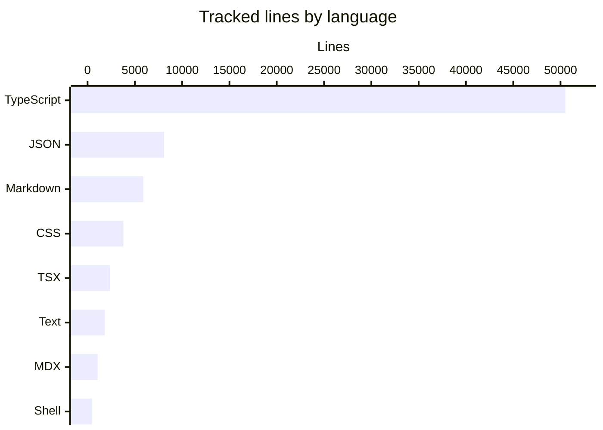

# By the numbers

This snapshot measures `origin/main` as collected on 2026-08-23 at commit `e8eb3e3`. The working branch had the same tracked tree at collection time, so its source statistics were identical. Untracked files are not counted.

The repository contained 313 tracked files. Counts below use Git blobs rather than the working directory, exclude `bun.lock` and the generated `apps/web/next-env.d.ts`, and exclude build output, dependency directories, and binary assets. Raw line counts include blank and comment lines.

## Size by language

The tracked text corpus contains 74,592 lines across 296 files with recognized text formats. TypeScript accounts for 67.7% of those lines. Checked-in documentation, research evidence, and contract snapshots remain in this census because they are tracked text; the active-source measurements later on this page exclude archived evidence.

| Language or format | Files | Lines | Share |
| --- | ---: | ---: | ---: |
| TypeScript | 135 | 50,510 | 67.7% |
| JSON | 36 | 8,090 | 10.8% |
| Markdown | 62 | 5,897 | 7.9% |
| CSS | 4 | 3,788 | 5.1% |
| TSX | 14 | 2,352 | 3.2% |
| Plain text | 14 | 1,815 | 2.4% |
| MDX | 13 | 1,059 | 1.4% |
| Shell | 5 | 472 | 0.6% |
| YAML | 6 | 316 | 0.4% |
| JavaScript | 2 | 197 | 0.3% |
| MongoDB configuration | 2 | 55 | 0.1% |
| JSONC | 3 | 41 | 0.1% |

## Source, test, and configuration inventory

The active tree has 101 implementation and support source files containing 33,464 lines, 48 test files containing 14,678 lines, and 42 configuration or manifest files containing 1,294 lines. The 13 MDX product-documentation files add 1,059 content-source lines and are reported separately from implementation code.

The implementation count covers TypeScript, TSX, JavaScript, CSS, and shell files under active application, package, script, and Docker paths. Test files include unit, type, and end-to-end test naming conventions. Configuration includes workspace and package manifests, TypeScript project files, deployment configuration, CI workflows, and database configuration. Files under `.scratch/` and `docs/research/evidence/` do not enter these active-source counts.

There are 10 Bun workspaces: four private applications and six package workspaces. All six package workspaces are non-private package surfaces.

## Average file size by subsystem

Average size uses implementation source only, except that `apps/docs` uses its MDX content source. Tests appear separately so large test suites do not inflate the production average.

| Subsystem | Source files | Source lines | Average lines | Test files | Test lines |
| --- | ---: | ---: | ---: | ---: | ---: |
| `apps/api` | 10 | 6,587 | 658.7 | 4 | 4,136 |
| `apps/docs` | 13 | 1,059 | 81.5 | 0 | 0 |
| `apps/mcp` | 1 | 1,571 | 1,571.0 | 1 | 500 |
| `apps/web` | 19 | 6,930 | 364.7 | 8 | 530 |
| `packages/client` | 4 | 2,337 | 584.2 | 2 | 299 |
| `packages/lib` | 14 | 1,168 | 83.4 | 1 | 29 |
| `packages/mdbrain-memory` | 1 | 2 | 2.0 | 0 | 0 |
| `packages/memory-bridge` | 9 | 2,585 | 287.2 | 9 | 2,081 |
| `packages/tools` | 4 | 873 | 218.2 | 3 | 814 |
| `packages/wiki-engine` | 19 | 7,021 | 369.5 | 16 | 5,937 |
| `scripts` | 16 | 4,003 | 250.2 | 4 | 352 |
| `docker` | 4 | 387 | 96.8 | 0 | 0 |

`apps/mcp` has the highest average because its implementation remains concentrated in `apps/mcp/src/server.ts`. `apps/api` is the next most concentrated subsystem, led by routing and OpenAPI source.

## Largest active source files

This ranking excludes tests, configuration, generated files, and archived evidence.

| Lines | Source file |
| ---: | --- |
| 2,502 | `apps/api/src/routes/v1.ts` |
| 2,337 | `apps/api/src/openapi-spec.ts` |
| 1,571 | `apps/mcp/src/server.ts` |
| 1,417 | `apps/web/app/demo/demo.module.css` |
| 1,310 | `apps/web/app/landing.module.css` |
| 1,220 | `packages/wiki-engine/src/okf.ts` |
| 1,078 | `packages/client/src/client.ts` |
| 941 | `packages/wiki-engine/src/wiki-schema.ts` |
| 869 | `packages/client/src/types.ts` |
| 786 | `packages/wiki-engine/src/wiki-bridge.ts` |

The large routing, protocol, and schema files are useful starting points for the concerns recorded in [Cleanup opportunities](cleanup-opportunities.md).

## Package surface and complexity

Public-symbol counts come from the TypeScript compiler's module exports for every package entry point declared by the package. A symbol exposed through more than one entry point is counted once per package. Runtime dependency counts use direct `dependencies`; peer dependencies are shown separately.

| Package | Source files | Source lines | Export entry points | Unique exported symbols | Direct runtime dependencies | Peer dependencies |
| --- | ---: | ---: | ---: | ---: | ---: | ---: |
| `@mdbrain/client` | 4 | 2,337 | 1 | 52 | 0 | 0 |
| `@mdbrain/lib` | 14 | 1,168 | 3 | 57 | 0 | 0 |
| `@mdbrain/memory` | 1 | 2 | 1 | 83 | 2 | 0 |
| `@mdbrain/memory-bridge` | 9 | 2,585 | 1 | 31 | 1 | 0 |
| `@mdbrain/tools` | 4 | 873 | 3 | 7 | 2 | 1 |
| `@mdbrain/wiki-engine` | 19 | 7,021 | 1 | 142 | 3 | 0 |

`@mdbrain/memory` is a two-line re-export facade, so its 83-symbol surface reflects the combined client and bridge APIs rather than local implementation. `@mdbrain/wiki-engine` has both the largest package implementation and the widest direct export surface. See [Dependencies](reference/dependencies.md) for the workspace and external dependency graph.

## Recent activity

Activity uses committer timestamps in UTC and half-open date windows. Additions and deletions are Git `numstat` line totals with rename detection enabled; generated files and binary changes are excluded.

| Window | Commits | Paths touched | Additions | Deletions | Total churn |
| --- | ---: | ---: | ---: | ---: | ---: |
| 2026-08-17 through 2026-08-23 | 3 | 427 | 40,731 | 113,101 | 153,832 |
| 2026-08-10 through 2026-08-16 | 0 | 0 | 0 | 0 | 0 |
| 2026-07-25 through 2026-08-23 | 13 | 429 | 45,522 | 113,535 | 159,057 |
| 2026-06-25 through 2026-07-24 | 41 | 437 | 155,486 | 12,539 | 168,025 |
| 2026-05-26 through 2026-08-23 | 54 | 575 | 201,008 | 126,074 | 327,082 |

The latest eight ISO weeks recorded 0, 25, 16, 0, 10, 0, 0, and 3 commits, from the week beginning 2026-06-29 through the week beginning 2026-08-17. On a calendar-month basis, July recorded 51 commits and August recorded 3 through 2026-08-23. The high deletion count in the latest month comes primarily from removing the copied memory engine during the Memongo HTTP boundary cutover.

## Bot-attributed commits

The transparent lower bound is **0 of 54 commits, or 0.0%**, in the 90-day window. A commit counts as bot-attributed only when its author name or email contains `[bot]`, a standalone `bot`, `dependabot`, `renovate`, or `github-actions`, case-insensitively.

This is a lower bound, not a claim that automation produced no code. Squashed changes, commits attributed to a human account, and AI-assisted work leave no reliable author-marker evidence and therefore remain outside the numerator.

## Ninety-day churn hotspots

Churn is additions plus deletions per source path from 2026-05-26 through 2026-08-23. Rename detection is enabled. Removed paths remain in the ranking because deletion is part of the period's maintenance cost.

| Source file | Additions | Deletions | Churn | Present on snapshot |
| --- | ---: | ---: | ---: | --- |
| `packages/memory-engine/src/mongodb-manager.ts` | 10,090 | 10,090 | 20,180 | No |
| `packages/memory-engine/src/mongodb-manager.test.ts` | 4,883 | 4,883 | 9,766 | No |
| `packages/memory-engine/src/mongodb-schema.ts` | 3,989 | 3,989 | 7,978 | No |
| `packages/memory-engine/src/production-readiness.e2e.test.ts` | 3,655 | 3,655 | 7,310 | No |
| `packages/memory-engine/src/mongodb-schema.test.ts` | 2,834 | 2,834 | 5,668 | No |
| `packages/memory-engine/src/real-e2e-v2.e2e.test.ts` | 2,553 | 2,553 | 5,106 | No |
| `apps/api/src/app.test.ts` | 3,843 | 1,162 | 5,005 | Yes |
| `packages/memory-engine/src/e2e-evaluation.e2e.test.ts` | 2,315 | 2,315 | 4,630 | No |
| `apps/api/src/routes/v1.ts` | 3,551 | 1,049 | 4,600 | Yes |
| `apps/mcp/src/server.ts` | 2,831 | 1,260 | 4,091 | Yes |
| `packages/memory-engine/src/mongodb-e2e.e2e.test.ts` | 1,959 | 1,959 | 3,918 | No |
| `packages/memory-engine/src/mongodb-search-executor.ts` | 1,919 | 1,919 | 3,838 | No |

The retired `packages/memory-engine` dominates historical churn because it was created and then removed inside the same 90-day window. Among files still present, the main hotspots are the API test suite, API router, and MCP server. [Architecture](overview/architecture.md) explains the resulting service boundary and ownership split.
