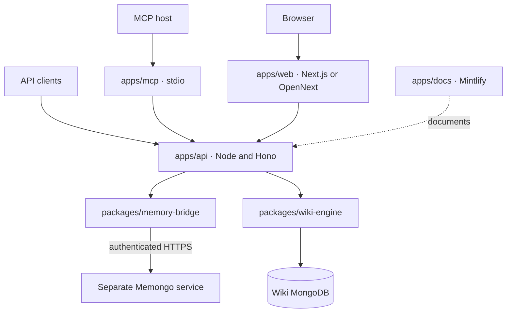

# Deployment

MDBrain deploys as an API in front of two separately owned data services: a Memongo HTTP service for memory and a transaction-capable MongoDB deployment for the wiki. The MCP process, web application, and documentation site are separate runtimes that depend on the API or static source.

## Runtime topology



MDBrain does not start Memongo, import its internal packages, or access its collections. `MEMONGO_API_URL` points to an independently deployed compatible service. `MDBRAIN_WIKI_MONGODB_URI` points to the MongoDB deployment owned by MDBrain's wiki. The separation is implemented in `packages/memory-bridge/src/memongo-runtime.ts` and `packages/wiki-engine/src/wiki-store.ts`.

## Prerequisites

- Node.js 20.19 or newer, as required by `package.json`.
- Bun 1.2.5, which is pinned in `package.json` and the GitHub Actions workflows.
- A compatible Memongo HTTP service that exposes the accepted 2.0.1 contract.
- A MongoDB replica set or sharded cluster for wiki transactions.
- Docker and Docker Compose for the repository's local MongoDB options.

Install the workspace before starting an application:

```bash
bun install --frozen-lockfile
bun run build
```

The API loads workspace package entry points from built `dist` output. Rebuild after changing a package.

## Choose a local MongoDB tier

The repository provides several local MongoDB configurations. The wiki's production path requires transactions, so standalone MongoDB is useful only for limited MongoDB experiments and is not a valid API readiness target.

| Configuration | Command or file | Transactions | Search features | MDBrain wiki use |
| --- | --- | ---: | --- | --- |
| Minimal replica set | `docker/docker-compose.minimal.yml` | Yes | MongoDB-native text features only | Small local API setup |
| Atlas Local preview | `docker/mongodb/docker-compose.preview.yml` | Yes | Atlas Search, Vector Search, and optional auto-embedding | Recommended full local feature set |
| Multi-container `replicaset` | `docker/mongodb/docker-compose.mongodb.yml` | Yes | `$text`, without `mongot` | Transaction-focused validation |
| Multi-container `fullstack` | `docker/mongodb/docker-compose.mongodb.yml` | Yes | Search, vector search, and optional auto-embedding | Advanced topology validation |
| Multi-container `standalone` | `docker/mongodb/docker-compose.mongodb.yml` | No | No Atlas Search or Vector Search | Not supported for wiki mutations or readiness |

Start the minimal transaction-capable database:

```bash
docker compose -f docker/docker-compose.minimal.yml up -d
```

Start Atlas Local preview:

```bash
VOYAGE_API_KEY=al-your-atlas-model-api-key \
  docker compose -f docker/mongodb/docker-compose.preview.yml up -d
```

The preview image uses `mongodb://localhost:27017/?directConnection=true` without authentication and stores data in named volumes. `VOYAGE_API_KEY` must be a MongoDB Atlas Model API key with an `al-` prefix when auto-embedding is enabled.

The advanced profiles require the setup generator before the authenticated replica-set or full-stack profile:

```bash
docker compose -f docker/mongodb/docker-compose.mongodb.yml \
  --profile setup run --rm setup-generator
docker compose -f docker/mongodb/docker-compose.mongodb.yml \
  --profile fullstack up -d
```

`replicaset` and `fullstack` share the `mongod_data` volume. `standalone` uses `mongod_standalone_data`, so moving from standalone to a replica set does not migrate data. See `docker/mongodb/README.md` for profile-specific commands, ports, and troubleshooting.

## Configure the API

Use `.env.example` as the variable inventory. A minimal local configuration is:

```bash
export MDBRAIN_WIKI_MONGODB_URI="mongodb://127.0.0.1:27017/?replicaSet=rs0"
export MEMONGO_API_URL="http://127.0.0.1:3900"
export MEMONGO_API_KEY="local-memongo-secret"
export MEMONGO_ALLOW_INSECURE_LOCAL=1
export MDBRAIN_API_KEY="local-dev-secret"
```

The main deployment variables are:

| Variable | Required | Purpose |
| --- | ---: | --- |
| `MDBRAIN_WIKI_MONGODB_URI` | Yes | Wiki-owned replica-set or sharded-cluster connection string |
| `MDBRAIN_WIKI_DATABASE` | No | Wiki database; defaults to `mdbrain_wiki` |
| `MDBRAIN_WIKI_COLLECTION_PREFIX` | No | Wiki collection prefix; defaults to `mdbrain_` |
| `MEMONGO_API_URL` | Yes | Base URL of the separate Memongo service |
| `MEMONGO_API_KEY` | Yes | Tenant credential for Memongo product operations |
| `MEMONGO_CONTROL_API_KEY` | No | Separate credential for selected control readiness probes |
| `MEMONGO_READINESS_CONTROL_LANES` | No | Unique comma-separated subset of `control`, `embedding`, and `vector` |
| `MEMONGO_TIMEOUT_MS` | No | Per-request Memongo timeout; defaults to 10,000 ms |
| `MEMONGO_COMPATIBILITY_TTL_MS` | No | Contract-check cache lifetime; defaults to 60,000 ms |
| `MEMONGO_ALLOW_INSECURE_LOCAL` | Local only | Allows HTTP only when `MEMONGO_API_URL` is loopback |
| `MDBRAIN_API_KEY` | Network deployment | Unrestricted administrator bearer key |
| `MDBRAIN_API_SCOPED_KEYS` | Alternative or supplement | JSON principal policies with bounded agents, scopes, and capabilities |
| `MDBRAIN_API_HOST` | No | API bind address; defaults to `127.0.0.1` |
| `MDBRAIN_API_PORT` | No | API port; defaults to `3847` |
| `MDBRAIN_DELIVERY_RECONCILE_MS` | No | Durable delivery reconciliation interval; defaults to 5,000 ms |
| `MDBRAIN_OKF_ALLOWED_ROOTS` | For OKF filesystem use | Comma-separated roots allowed for OKF import and export |

Production transport to Memongo must use HTTPS. `packages/memory-bridge/src/memongo-http-client.ts` rejects credentials embedded in the URL, disables redirects, and permits plain HTTP only for loopback when `MEMONGO_ALLOW_INSECURE_LOCAL=1`.

Configure browser and edge behavior explicitly:

| Variable | Behavior |
| --- | --- |
| `MDBRAIN_API_CORS_ORIGINS` | Comma-separated browser origins accepted by the Hono CORS middleware |
| `MDBRAIN_API_RATE_LIMIT_MAX` | Per-process request count per window; defaults to `100`, and `0` disables it |
| `MDBRAIN_API_RATE_LIMIT_WINDOW_MS` | In-memory limiter window; defaults to `60000` |
| `MDBRAIN_API_TRUST_PROXY` | When `true`, accepts the first `X-Forwarded-For` value for rate-limit identity |
| `NEXT_PUBLIC_MDBRAIN_API_URL` | Browser-visible API base URL used by `apps/web/app/console/page.tsx` |
| `NEXT_PUBLIC_SITE_URL` | Metadata base used by `apps/web/app/layout.tsx` |
| `MDBRAIN_WEB_STATIC_EXPORT` | Set to `true` to make `apps/web/next.config.ts` produce a static export |

See [Security](../security.md) before exposing the API or browser console.

## Run the applications

### API

Start the Node HTTP server:

```bash
bun run --cwd apps/api start
```

For local development with file watching:

```bash
bun run --cwd apps/api dev
```

`apps/api/src/server.ts` starts Hono, the memory-delivery reconciler, and graceful shutdown handlers. On `SIGTERM` or `SIGINT`, it stops accepting requests, stops reconciliation, closes the Memongo bridge and wiki store, and exits nonzero if the 15-second shutdown deadline expires.

### MCP

The MCP application is a local stdio process, not an HTTP service:

```bash
MDBRAIN_API_URL=http://127.0.0.1:3847 \
MDBRAIN_API_KEY=local-dev-secret \
bun run --cwd apps/mcp start
```

`apps/mcp/src/server.ts` uses `@mdbrain/client` and never connects directly to MongoDB or Memongo. Give each MCP host a scoped MDBrain key when possible.

### Web

Run the Next.js development server on port 3040:

```bash
bun run --cwd apps/web dev
```

Run the production Node build:

```bash
bun run --cwd apps/web build
bun run --cwd apps/web start
```

The `/console` route sends the bearer key entered by the user from the browser. Set `MDBRAIN_API_CORS_ORIGINS` to the deployed web origin and decide explicitly whether browser-held credentials are acceptable.

### Docs

Run the Mintlify development server on port 3003:

```bash
bun run --cwd apps/docs dev
```

`bun run --cwd apps/docs build` runs `scripts/check-docs-integrity.mjs`. `bun run --cwd apps/docs validate:mintlify` runs `scripts/validate-mintlify-build.mjs`.

## Cloudflare and OpenNext

The implemented Cloudflare deployment command belongs to the web application:

```bash
bun run web:preview
bun run web:deploy
```

Both commands build with `@opennextjs/cloudflare`. `apps/web/open-next.config.ts` uses the default OpenNext Cloudflare configuration. `apps/web/wrangler.jsonc` points to `.open-next/worker.js`, serves `.open-next/assets` through the `ASSETS` binding, defines the `WORKER_SELF_REFERENCE` service binding, enables `nodejs_compat` and `global_fetch_strictly_public`, and enables Workers observability.

`apps/api/wrangler.jsonc` and `apps/mcp/wrangler.jsonc` declare Worker names, source entry points, `nodejs_compat`, and observability. They are not complete deployment paths in the current repository: `apps/api/package.json` has no Wrangler deployment script and `apps/api/src/server.ts` starts a Node server, while `apps/mcp/src/server.ts` implements stdio and `apps/mcp/package.json` has no Wrangler deployment script. Treat Node API and stdio MCP as the implemented runtimes unless their entry points are adapted and tested for Workers.

## Readiness and release proof

Use `GET /health` only for process liveness. Route traffic only after `GET /ready` succeeds:

```bash
curl -fsS "$MDBRAIN_API_URL/health"
curl -fsS "$MDBRAIN_API_URL/ready"
```

`GET /ready` checks:

1. The Memongo OpenAPI version and canonical SHA-256 match the pin in `packages/memory-bridge/src/memongo-runtime.ts`.
2. A non-mutating Memongo `/v1/state` request succeeds.
3. Every configured control readiness lane succeeds with `MEMONGO_CONTROL_API_KEY`.
4. The wiki database responds to `ping` and completes a transaction.

The API caches readiness results for one second. A failure returns HTTP 503 with the failing Memongo lane or `wiki`.

Run the repository gates before promotion:

```bash
bun install --frozen-lockfile
bun run check-types
bun run lint
bun run build
bun run check-publishability
bun run test
```

Then run integrated checks against live dependencies:

```bash
bun run proof-pack
bun run memory-eval
bun run agent-smoke
```

`scripts/proof-pack.ts` checks health, readiness, required OpenAPI paths, writes, retrieval, active state, context, and profile behavior. It writes test memory under generated agent and session identifiers, so run it against an isolated validation tenant or an approved canary. A JSON artifact is written only when `MDBRAIN_PROOF_ARTIFACT_DIR` is set or a local `proof-artifacts/` directory already exists.

Do not promote a release when contract compatibility, transaction support, scope isolation, idempotency replay, delivery reconciliation, promotion, or redaction checks fail. The complete gate list is in `docs/platform/PRODUCTION-READY.md` and `docs/platform/validation-pack.md`.

## CI and package publishing

`.github/workflows/ci.yml` runs for pull requests and pushes to `main`. It installs with the frozen lockfile, then runs type checking, linting, build, publishability checks, and tests.

`.github/workflows/publish.yml` runs manually or for `v*` tags. It:

1. Checks out one commit and installs with Bun 1.2.5.
2. Uses Node.js 22 for npm publishing.
3. Builds, tests, and runs `bun run check-publishability`.
4. Reads the single authoritative package order from `scripts/publish-package-cohort.ts`.
5. Skips an exact version already present in npm.
6. Publishes each missing public package with `npm publish --access public --provenance`.

The cohort order is `@mdbrain/lib`, `@mdbrain/wiki-engine`, `@mdbrain/memory-bridge`, `@mdbrain/client`, `@mdbrain/tools`, and `@mdbrain/memory`. The workflow grants `id-token: write` for npm provenance and supplies `NPM_TOKEN` from the repository secret.

`scripts/check-publishability.ts` verifies package metadata, built `dist` entry points, README inclusion, the absence of source/tests/`tsconfig.json` from tarballs, exact sibling cohort versions, and clean installation and import from packed tarballs. The publish workflow itself does not run lint or type checking, so require the CI workflow on the release commit.

## Rollback and limitations

- The repository has no deployment orchestrator or automated rollback command. Keep the previous API and web artifacts addressable and redeploy a known-good version when a release fails.
- Roll back MDBrain independently of Memongo. An API rollback must continue to satisfy the pinned Memongo contract; do not point the old API at an unverified contract.
- Do not use the removed local memory engine as a fallback or dual-write destination. Memory remains owned by Memongo, and wiki data remains in the wiki database.
- Package versions on npm are immutable. The publish workflow skips an existing version; publish a corrective version instead of attempting to overwrite it.
- MongoDB data rollback, backup, and restore are operator responsibilities. The local Compose profiles use named volumes, but the repository does not define a production backup workflow.
- The in-memory API rate limiter is local to one process and is not a distributed quota system.
- Atlas Search, Vector Search, `$rankFusion`, `$rerank`, and auto-embedding depend on a matching MongoDB topology. A transaction-capable replica set alone does not provide those search features.
- The repository provides a tested OpenNext deployment path only for `apps/web`. The API and MCP Wrangler files do not replace their implemented Node and stdio runtime requirements.

For a shorter local procedure, see [Getting started](../overview/getting-started.md). For service internals, see [Architecture](../overview/architecture.md), [API](../apps/api.md), and [Memory bridge](../packages/memory-bridge.md).
