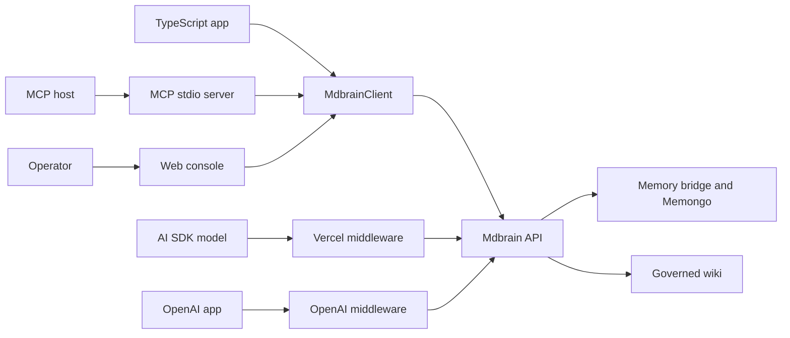

# Agent integrations

Active contributors: Rom Iluz

## Purpose

Mdbrain can be called as a typed HTTP client, exposed as MCP tools, inserted around model calls, or operated through the web console. Each surface converges on the same API rather than opening a separate database connection, which keeps authentication, scope enforcement, durable-write behavior, and remote Memongo compatibility in one place.

See the [apps](../apps/index.md), [packages](../packages/index.md), [API](../api/index.md), and [security model](../security.md) for deployment and trust-boundary details.

## Integration surfaces

| Surface | Intended caller | Main behavior |
| --- | --- | --- |
| `MdbrainClient` | TypeScript applications | Typed methods over the complete supported HTTP surface |
| MCP server | MCP-capable coding and assistant agents | Named memory, lifecycle, context, and wiki tools over stdio |
| AI SDK tools | Vercel AI SDK agents | Tool objects backed by an existing `MdbrainClient` |
| Vercel middleware | AI SDK language models | Injects context and captures user and assistant turns |
| OpenAI middleware | OpenAI-compatible clients | Proxies chat completion calls to inject context and capture non-streamed turns |
| Web console | Operators and developers | Interactive health, OpenAPI, search, profile, write, and wiki inspection |

## End-to-end flow

## TypeScript client

`MdbrainClient` in `packages/client/src/client.ts` is the base integration. It covers memory search, detailed search, knowledge-base search, conversation recall, profile and state views, active slate, discovery projections, context bundles, event writes, lifecycle operations, feedback, and wiki operations.

Transport behavior is centralized in `packages/client/src/transport.ts`. The client uses `MDBRAIN_API_URL` and `MDBRAIN_API_KEY` when constructor options are absent, defaults to `http://127.0.0.1:3847`, and gives each call a 10-second total deadline by default. Safe reads and same-idempotency-key writes can retry 429 and 503 responses within that deadline; wiki mutations use the no-retry policy. Caller cancellation and deadline expiry become distinct `MdbrainClientError` codes.

`wikiApply` is a client-side upsert in `packages/client/src/client.ts`: it attempts `POST /v1/wiki`, catches a 409 duplicate slug, and issues `PATCH /v1/wiki/:slug` with the time left from the original deadline. This is a convenience over the API's explicit create and update routes.

## MCP tools

`apps/mcp/src/server.ts` starts an MCP server over standard input/output and constructs one `MdbrainClient` for tool execution. Tool definitions validate or normalize their arguments, invoke the matching client method, and return JSON as MCP text content. Errors are returned as error results rather than crashing the server.

The tool set includes:

- Memory search, detailed search, knowledge-base search, writes, profile, active slate, discovery projection, context bundle, and unified state.
- Conversation recall plus semantic aliases for recall and lifecycle operations.
- Stable-handle lifecycle get, update, delete, history, procedure outcome, and structured-memory feedback.
- Wiki search, get, create-or-update, lint, and OKF import/export.

The MCP wiki search schema currently exposes recipes but not the wiki engine's optional graph expansion or rerank hooks. See [Hybrid retrieval](hybrid-retrieval.md) for that boundary.

## AI SDK tools and middleware

`createMdbrainTools` in `packages/tools/src/index.ts` returns Vercel AI SDK `tool` objects backed by a supplied client. It focuses on memory workflows: search, knowledge-base search, add, write-event, profile, context bundle, conversation recall, lifecycle operations, procedure outcomes, feedback, and unified state. Wiki-specific tools are available through the MCP server, not this tool factory.

`withMdbrain` in `packages/tools/src/vercel/index.ts` wraps a `LanguageModelV2`. Before generation or streaming, it extracts the latest text user part, requests `/v1/context-bundle`, and prepends the returned rendering as a `[Memory Context]` system message. A 50-entry, 60-second in-process cache is keyed by user and query. Failed context requests return an empty string, so the model call proceeds without memory rather than failing.

After a Vercel AI SDK call, the middleware sends user and assistant text to `/v1/write-event`. For streaming responses it collects text deltas and writes the assistant turn when the stream flushes. `fireWriteEvent` in `packages/tools/src/write-event.ts` creates a new idempotency key, retries once on network errors, 408, 429, or 5xx responses, and reports the final failure through `onWriteError` or `console.warn` without rejecting the model call.

`createOpenAIMiddleware` in `packages/tools/src/openai/index.ts` wraps any client with the `chat.completions.create` shape and applies the same context injection. It records the user and non-streamed assistant response. It cannot intercept streamed assistant chunks through this proxy, so streaming callers must write that assistant turn themselves or use the Vercel middleware.

## Web surfaces

`apps/web/app/console/page.tsx` is an operator-facing client of `MdbrainClient`. It accepts an API URL, optional bearer key, agent ID, and scope value, then exposes overview, memory search, knowledge-base search, profile, write, and wiki tabs. The overview reads `/health` and `/openapi.json` through `apps/web/app/console/overview.ts`; the wiki tab lists pages through `wikiLint` or fetches one page by slug.

The retrieval autopsy under `apps/web/app/demo/components/retrieval-autopsy.tsx` is a guided product explanation rather than a live query console. Its `apps/web/app/demo/components/context-bundle.tsx` view switches between readable trust signals and representative JSON. This distinction matters when validating integrations: the console exercises live API responses, while the demo uses the synthetic scenario in `apps/web/lib/marketing/demo-scenario.ts`.

## Choosing an integration

- Use `MdbrainClient` when application code needs explicit control over individual operations and errors.
- Use the MCP server when an agent host discovers and invokes tools over MCP.
- Use `createMdbrainTools` when a Vercel AI SDK agent should decide when to call memory operations.
- Use `withMdbrain` or `createOpenAIMiddleware` when every model call should receive context automatically and conversation turns should be captured with minimal application code.
- Use the web console to inspect a running API manually, not as an embedded application SDK.

All remote paths still require an appropriate bearer principal when API authentication is configured. Scope and capability checks occur in the API even when the integration has already validated its local input.

## Integration points

- [Context delivery](context-delivery.md) defines the bundle and write-receipt contracts used by middleware and tools.
- [Governed wiki](governed-wiki.md) defines the page operations exposed through the client, MCP server, and console.
- The [API app](../apps/api.md), [MCP app](../apps/mcp.md), and [web app](../apps/web.md) pages cover runtime concerns.
- The [client package](../packages/client.md) and [tools package](../packages/tools.md) pages cover package ownership and exports.

## Entry points for modification

Add or change HTTP client methods in `packages/client/src/client.ts` and transport policy in `packages/client/src/transport.ts`. Add MCP-facing tools in both the definition list and dispatch handler in `apps/mcp/src/server.ts`. Change automatic prompt injection in `packages/tools/src/vercel/index.ts` or `packages/tools/src/openai/index.ts`, and keep shared write reporting in `packages/tools/src/write-event.ts`. Console actions begin in `apps/web/app/console/page.tsx`.

## Key source files

| File | Purpose |
| --- | --- |
| `packages/client/src/client.ts` | Typed high-level API methods and response models |
| `packages/client/src/types.ts` | Public operation input types |
| `packages/client/src/transport.ts` | Authentication headers, deadlines, retries, and errors |
| `apps/mcp/src/server.ts` | MCP tool catalog, validation, dispatch, and stdio entry point |
| `packages/tools/src/index.ts` | AI SDK tool factory and middleware exports |
| `packages/tools/src/vercel/index.ts` | Vercel AI SDK context and write middleware |
| `packages/tools/src/openai/index.ts` | OpenAI-compatible context and write proxy |
| `packages/tools/src/write-event.ts` | Best-effort conversation write helper |
| `apps/web/app/console/page.tsx` | Live operator console |
| `apps/web/app/console/overview.ts` | Health and OpenAPI overview loader |
| `apps/web/app/demo/components/retrieval-autopsy.tsx` | Guided retrieval demonstration |
| `apps/web/app/demo/components/context-bundle.tsx` | Human and JSON views of representative bundle output |
