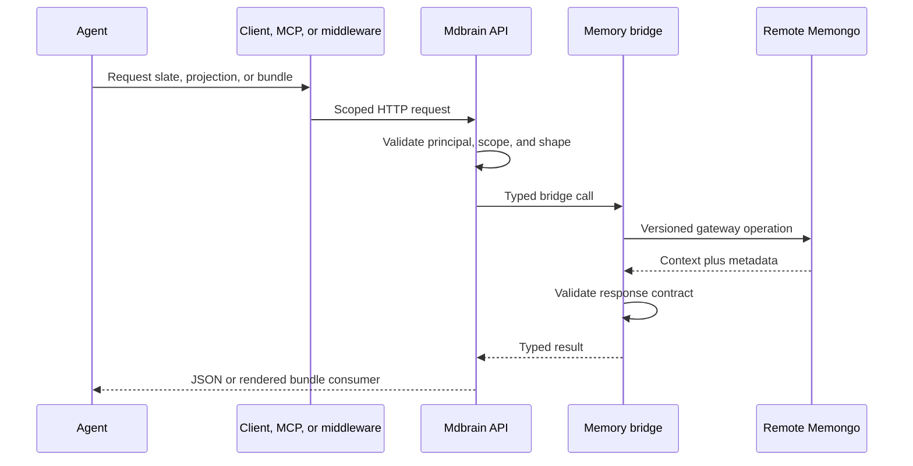
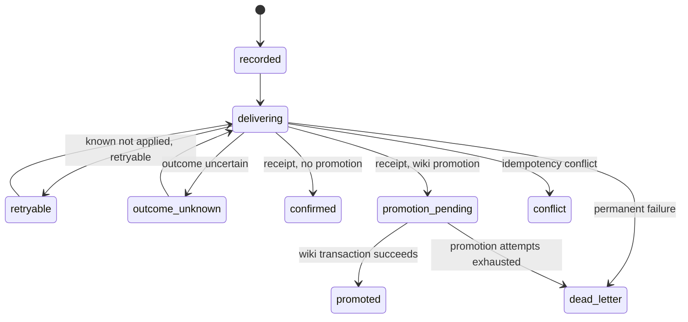

# Context delivery

Active contributors: Rom Iluz

## Purpose

Context delivery turns durable memory into bounded, inspectable inputs for an agent and records new conversations with replay-safe receipts. The active slate, discovery projection, and context bundle are computed by the remote Memongo runtime; this repository owns their HTTP contracts, adapters, consumers, and the durable ledger that can promote a confirmed write into the governed wiki.

For package boundaries, see [memory bridge](../packages/memory-bridge.md), [client](../packages/client.md), and [wiki engine](../packages/wiki-engine/index.md). The [API](../api/index.md) and [security model](../security.md) cover the public and trust boundaries.

## Directory layout

```text
packages/memory-bridge/src/
├── mdbrain-bridge.ts             # Typed active-slate, projection, and bundle adapters
├── memongo-gateway-contract.ts   # Remote operation and response validation
└── memongo-http-client.ts        # Authenticated, version-checked HTTP transport
apps/api/src/
├── routes/v1.ts                  # Context and write routes
├── memory-delivery-runtime.ts    # Durable dispatch, receipt, promotion, reconciliation
└── server.ts                     # Starts the delivery reconciler
packages/wiki-engine/src/
└── memory-delivery.ts            # Delivery-intent state machine and ledger
packages/client/src/
├── client.ts                     # Public response models and HTTP methods
└── types.ts                      # Context request and promotion inputs
```

## Read surfaces

| Surface | Input focus | Output |
| --- | --- | --- |
| Active slate | Agent, scope, scope reference, item cap | Highest-salience active items plus truncation, partial, kind, and source counts |
| Discovery projection | Projection kind, optional query and time range | A synthesized brief with sections and source evidence |
| Context bundle | Query, session, token budget, section caps, optional projection/profile, mode | Rendered prompt context plus structured sections, trust, token, truncation, and path metadata |

`MdbrainBridgeActiveSlate`, `MdbrainBridgeDiscoveryProjection`, and `MdbrainBridgeContextBundle` in `packages/memory-bridge/src/mdbrain-bridge.ts` document the response shapes that the adapter expects from Memongo. The gateway validators in `packages/memory-bridge/src/memongo-gateway-contract.ts` reject incompatible envelopes before they reach the API.

Discovery projections support `entity-brief`, `topic-brief`, `what-changed`, and `contradiction-report`. Entity and topic briefs require a query at the API boundary in `apps/api/src/routes/v1.ts`; change and contradiction projections can be driven by scope and time range.

A context bundle may contain active-slate, query-evidence, summary, recent-events, discovery-projection, and profile sections. It reports per-section token estimates and partial or truncated status, while top-level metadata records the token budget, paths executed, sections included, and aggregate trust. `wake-up` mode asks for a compact session-start projection; `full` mode can use the latest user query.

## Context request flow



The bridge checks the remote OpenAPI version and canonical SHA-256 before operations through `packages/memory-bridge/src/memongo-http-client.ts`. It sends tenant credentials, enforces deadlines, and classifies errors by retryability and whether a write was definitely applied. The local repository does not implement active-slate ranking or bundle assembly; those algorithms are behind the Memongo HTTP contract.

## Trust metadata

`MdbrainContextBundleSectionItem` in `packages/client/src/client.ts` carries trust beside individual evidence. Its dimensions are score, confidence, exactness, freshness, contradiction state, scope match, provenance density, source diversity, and explanatory factors. Bundle-level `trustSummary` aggregates the top and average scores, confidence distribution, contradiction and stale counts, exact matches, and source diversity.

This metadata lets an agent distinguish a relevant item from a usable one. The rendered string is convenient for prompt injection, while the parallel structured sections retain paths, canonical IDs, timestamps, scope, source event IDs, and trust details for inspection.

## Durable writes and receipts

`POST /v1/add` and `POST /v1/write-event` require an `Idempotency-Key` in `apps/api/src/routes/v1.ts`. The API derives an operation ID from the principal, scope pair, operation, and idempotency key, then records an intent before dispatching to Memongo.



The concrete state spelling is `outcome-unknown` and `promotion-pending` in `packages/wiki-engine/src/memory-delivery.ts`. A successful remote write produces a small receipt with `eventId` and `chunkCreated`. Replaying the same operation returns the stored receipt; changing the payload or authority dimensions under the same operation records the conflicting fields and produces a conflict instead.

`apps/api/src/memory-delivery-runtime.ts` classifies failed dispatches as retryable, outcome-unknown, dead-letter, or conflict. `apps/api/src/server.ts` starts a reconciler, which retries due states with bounded attempts and exponential delay. Active dispatch leases can age into outcome-unknown so a crashed process does not leave an intent claimed forever.

## Optional wiki promotion

A caller can set `promotionPolicy: "wiki"` and supply `wikiPromotion.page` on a memory write. `buildMemoryWikiPromotion` in `apps/api/src/memory-delivery-runtime.ts` requires the page to use the same scope pair as the memory event, validates page kind and trust tier, requires OKF frontmatter, and requires at least one stable claim. Changing trust or permissions still requires the principal's `change-permissions` capability.

Promotion cannot run until Memongo has returned a confirmed receipt. The transaction then appends the receipt's event ID to every promoted claim as `event` evidence and `derivedFrom` provenance, creates the page, records a wiki mutation intent, and marks the delivery `promoted`. A deterministic promotion key makes replay a no-op and detects a mismatched replay. See [Governed wiki](governed-wiki.md) for how the resulting claims are checked and stored.

## Integration points

- `packages/client/src/client.ts` exposes `hydrateActiveSlate`, `buildDiscoveryProjection`, `buildContextBundle`, `state`, `add`, and `writeEvent`.
- `apps/mcp/src/server.ts` exposes active-slate, discovery, bundle, unified-state, and memory-write tools.
- `packages/tools/src/index.ts` exposes a context-bundle AI SDK tool; its Vercel and OpenAI middleware inject the rendered bundle automatically.
- `apps/web/app/demo/components/context-bundle.tsx` renders representative bundle JSON and trust signals for the product demo.
- The [agent integrations](agent-integrations.md) page compares these consumption paths.

## Entry points for modification

Change the public context input and output types in `packages/client/src/types.ts` and `packages/client/src/client.ts`, then keep `packages/memory-bridge/src/mdbrain-bridge.ts`, `packages/memory-bridge/src/memongo-gateway-contract.ts`, `apps/api/src/routes/v1.ts`, and `apps/api/src/openapi-spec.ts` aligned. Change durable write semantics in `packages/wiki-engine/src/memory-delivery.ts`; change dispatch, reconciliation, or promotion orchestration in `apps/api/src/memory-delivery-runtime.ts`.

## Key source files

| File | Purpose |
| --- | --- |
| `packages/memory-bridge/src/mdbrain-bridge.ts` | Defines and forwards context-delivery operations |
| `packages/memory-bridge/src/memongo-gateway-contract.ts` | Validates remote context and receipt envelopes |
| `packages/memory-bridge/src/memongo-http-client.ts` | Enforces remote compatibility, credentials, and transport semantics |
| `apps/api/src/routes/v1.ts` | Validates context requests and requires idempotency on writes |
| `apps/api/src/memory-delivery-runtime.ts` | Orchestrates dispatch, reconciliation, receipts, and wiki promotion |
| `apps/api/src/server.ts` | Runs the background delivery reconciler |
| `packages/wiki-engine/src/memory-delivery.ts` | Persists delivery intents and enforces state transitions |
| `packages/client/src/client.ts` | Publishes typed context and trust response models |
| `packages/client/src/types.ts` | Publishes context request and wiki-promotion types |
