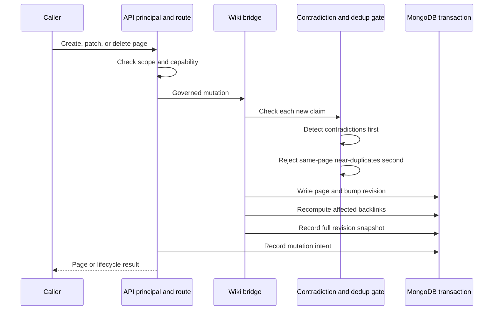

# Governed wiki

Active contributors: Rom Iluz

## Purpose

The governed wiki turns source material and durable memories into scoped, searchable pages for humans and agents. Its controls are applied inside the wiki engine as well as at the HTTP boundary, so direct reads, search, graph traversal, revision history, OKF export, and transclusion use the same scope and permission model.

See the [wiki engine package](../packages/wiki-engine/index.md) for module-level details, the [API](../api/index.md) for the route contract, and the [security model](../security.md) for principal authentication and authorization.

## Directory layout

```text
packages/wiki-engine/src/
├── wiki-schema.ts          # Page, revision, mutation, and delivery schemas
├── wiki-bridge.ts          # Page CRUD and rendering boundary
├── wiki-governance.ts      # Scope, trust, and permission filters
├── wiki-contradictions.ts  # Contradiction-before-dedup write gate
├── wiki-revisions.ts       # Full page snapshots
├── wiki-backlinks.ts       # Derived incoming relationship edges
├── wiki-transclusion.ts    # Governed inline page inclusion
└── wiki-renderer.ts        # Markdown and HTML rendering
apps/api/src/
├── principal.ts            # Server-derived identity and capabilities
└── routes/v1.ts            # Governed wiki HTTP operations
```

## Page and claim model

`WikiPageInput` and `WikiPage` in `packages/wiki-engine/src/wiki-bridge.ts` define the write model. A page has a kind, title, slug, summary, Markdown body, OKF-compatible frontmatter, scope, concrete `scopeRef`, trust tier, permissions, state, freshness, and revision. The MongoDB validator in `packages/wiki-engine/src/wiki-schema.ts` accepts six page kinds: `entity`, `concept`, `synthesis`, `source`, `report`, and `procedure`.

Claims are structured facts inside a page rather than untracked prose. Each claim has an ID, text, lifecycle status, confidence, validity dates, and optional provenance. Evidence can point to a file, URL, event, API, manual input, or agent; evidence entries may include a source ID, path and lines, weight, confidence, privacy tier, and note. `writerAgent`, `derivedFrom`, and `sourceMemId` preserve who or what produced a claim.

| Abstraction | Source | Role |
| --- | --- | --- |
| `WikiPageInput` | `packages/wiki-engine/src/wiki-bridge.ts` | Caller-supplied page content and governance attributes |
| `WikiPage` | `packages/wiki-engine/src/wiki-bridge.ts` | Stored page with lifecycle, backlink, transclusion, and search fields |
| `WikiClaimInput` | `packages/wiki-engine/src/wiki-bridge.ts` | Evidence-bearing factual assertion |
| `GovernanceContext` | `packages/wiki-engine/src/wiki-governance.ts` | Requester's scope, identity, groups, roles, departments, and trust tier |
| `WikiPageRevisionRecord` | `packages/wiki-engine/src/wiki-revisions.ts` | Immutable snapshot for one page revision |
| `Contradiction` | `packages/wiki-engine/src/wiki-contradictions.ts` | Conflict between at least two claims and its resolution |

## Write and lifecycle flow



Creation in `packages/wiki-engine/src/wiki-bridge.ts` initializes a page as `active`, revision 1, `fresh`, and valid from the write time. Updates preserve existing claims, append accepted new claims, refresh the auto-embedding text when title, summary, or body changes, increment the revision, and update affected backlinks. The normal delete path is a soft delete: it changes the page to `superseded`, closes `validTo`, and records another revision. Hard deletion is available only when explicitly requested.

The API performs page mutation and mutation-intent recording in one wiki transaction in `apps/api/src/routes/v1.ts`. Revision recording is strict when that transaction supplies a session. Direct package callers without a transaction get best-effort revision recording: `packages/wiki-engine/src/wiki-revisions.ts` logs a snapshot failure rather than blocking the page write.

Claims have their own lifecycle states: `active`, `superseded`, `contradicted`, or `disputed`. Old claims can therefore remain in the page as audit evidence instead of being overwritten. Page listings and searches exclude superseded pages by default.

## Permissions and governed reads

Authentication resolves a bearer credential to an `ApiPrincipal` in `apps/api/src/principal.ts`. The principal contains allowed agent IDs, allowed scope pairs, capabilities, trust tier, subject ID, namespaced groups, roles, and departments. The API requires `change-permissions` when a create changes the caller's trust tier or supplies a permission block, and when a patch changes permissions or trust. Hard delete and export are separate principal capabilities.

The engine then applies `buildGovernanceFilter` from `packages/wiki-engine/src/wiki-governance.ts`:

1. `scope` and `scopeRef` must exactly match the request context.
2. Administrators bypass page permission filtering, but not the exact scope filter.
3. Other callers can see pages with no restrictions, `public` or `internal` pages, or pages that explicitly match their subject, group, role, or department.

The same governed read gates revision lookup and OKF export in `apps/api/src/routes/v1.ts`. A caller cannot use revision history, export, graph traversal, or transclusion as a side channel to read a page that the live-page operation would hide.

## Contradictions and duplicate claims

`runWritePipelineGate` in `packages/wiki-engine/src/wiki-contradictions.ts` deliberately detects contradictions before checking duplicates. It examines claims on pages connected through the source page's `relationships`, ignores superseded claims, and records a conflict when the text has at least 0.3 word-level Jaccard overlap and exactly one side contains a recognized negation marker. Contradictions do not reject the new claim.

Only after that pass does the gate reject a same-page near-duplicate at 0.8 or greater text overlap. The heuristic is intentionally lightweight: it catches direct polarity conflicts, not arbitrary semantic disagreement. `/v1/wiki/lint` combines governed page listing with unresolved contradiction records. A resolution can be `newest_wins`, `authority_wins`, or `human_escalation`, with actor, time, and note fields.

## Revisions, backlinks, and transclusion

`packages/wiki-engine/src/wiki-revisions.ts` stores a full snapshot for each create, update, and delete in a separate collection, without the large embedding field. Revision lists omit snapshots and sort newest first; fetching one revision applies governance both to the current page and to the stored snapshot.

Relationships are explicit outgoing edges. `packages/wiki-engine/src/wiki-backlinks.ts` derives incoming `backlinks` in the same scope and updates only pages affected by a create, relationship change, or delete. Superseded source pages do not contribute backlinks.

Page bodies may contain `{{page:slug}}` or `{{page:slug#Section}}`. `packages/wiki-engine/src/wiki-transclusion.ts` stores the unique target slugs in `transcludes` and resolves content only when a caller asks for `transclude=true`. Resolution is recursive to five levels, uses the same governance context for every target, and replaces inaccessible, missing, circular, or over-deep references with HTML comments rather than failing the whole render.

## Integration points

- `apps/api/src/routes/v1.ts` exposes create, list, get, patch, soft or hard delete, search, lint, revision history, and OKF import/export routes.
- `packages/client/src/client.ts` provides wiki search, get, apply, lint, delete, import, and export methods. `wikiApply` tries create first and patches after a duplicate-slug response.
- `apps/mcp/src/server.ts` exposes wiki search, get, apply, lint, and OKF interchange to MCP clients.
- `apps/web/app/console/page.tsx` can list governed pages or fetch one page by slug, scope, and scope reference.
- [Hybrid retrieval](hybrid-retrieval.md) explains how governed pages are ranked. [Context delivery](context-delivery.md) explains optional promotion from a confirmed memory write.

## Entry points for modification

Change page fields and validation together in `packages/wiki-engine/src/wiki-schema.ts` and `packages/wiki-engine/src/wiki-bridge.ts`. Change visibility rules in `packages/wiki-engine/src/wiki-governance.ts`, then audit every read path and the API principal mapping in `apps/api/src/routes/v1.ts`. For a public contract change, also update `apps/api/src/openapi-spec.ts`, `packages/client/src/client.ts`, and `apps/mcp/src/server.ts`.

## Key source files

| File | Purpose |
| --- | --- |
| `packages/wiki-engine/src/wiki-schema.ts` | MongoDB validators, page fields, lifecycle enums, and indexes |
| `packages/wiki-engine/src/wiki-bridge.ts` | Page CRUD, claim processing, revision hooks, and rendering |
| `packages/wiki-engine/src/wiki-governance.ts` | Scope and page-permission enforcement |
| `packages/wiki-engine/src/wiki-contradictions.ts` | Contradiction detection, deduplication, lint data, and resolution |
| `packages/wiki-engine/src/wiki-revisions.ts` | Revision snapshots and governed history reads |
| `packages/wiki-engine/src/wiki-backlinks.ts` | Incremental and full backlink recomputation |
| `packages/wiki-engine/src/wiki-transclusion.ts` | Transclusion parsing and governed recursive resolution |
| `apps/api/src/principal.ts` | Principal policy parsing and request authorization |
| `apps/api/src/routes/v1.ts` | Public wiki routes and transactional mutation orchestration |
