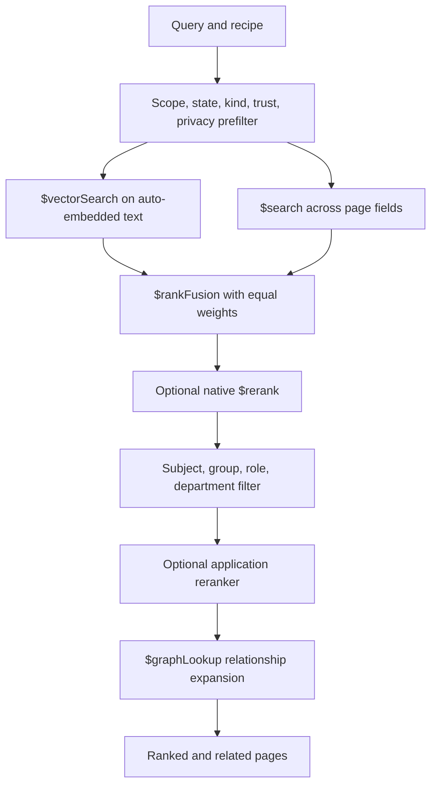

# Hybrid retrieval

Active contributors: Rom Iluz

## Purpose

Wiki retrieval combines semantic similarity with lexical matching, then can refine or expand the result set. Governance filters are applied before ranking where MongoDB search supports them and again after ranking for identity-based permissions.

This page traces the capability across the [wiki engine](../packages/wiki-engine/index.md), [API](../api/index.md), [client and MCP integrations](agent-integrations.md), and [security model](../security.md).

## Directory layout

```text
packages/wiki-engine/src/
├── wiki-schema.ts        # Atlas vector and text index definitions
├── wiki-search.ts        # Recipes, fusion, reranking, graph expansion, fallback
└── wiki-governance.ts    # Post-search identity permission filtering
apps/api/src/
└── routes/v1.ts          # /v1/wiki/search contract
packages/client/src/
└── client.ts             # wikiSearch HTTP method
apps/mcp/src/
└── server.ts             # mdbrain_wiki_search tool
```

## Retrieval stages



`WIKI_PAGES_SEARCH_INDEX_TARGETS` in `packages/wiki-engine/src/wiki-schema.ts` defines two Atlas indexes. The vector index auto-embeds each page's combined `text` field with `voyage-4-large`; the text index covers title, summary, body, aliases, and frontmatter tags. Both indexes expose kind, scope, scope reference, trust tier, page state, and privacy tier as filter fields.

`searchWikiPages` in `packages/wiki-engine/src/wiki-search.ts` always limits `maxResults` to 100 and excludes superseded pages unless a state is explicitly requested. The query pipeline chooses a recipe:

| Recipe | Search mode | Candidate multiplier | Intended tradeoff |
| --- | --- | ---: | --- |
| `fast` | Vector only | 10 | Lowest-cost semantic lookup |
| `hybrid` | Vector plus text with reciprocal-rank fusion | 20 | Default balance |
| `deep` | Vector plus text with reciprocal-rank fusion | 40 | Wider candidate pool |

The vector side uses `$vectorSearch` over the auto-embedded `text` field. Hybrid and deep recipes place vector and Atlas text pipelines under `$rankFusion` with equal weights and score details enabled. The returned result records whether its source was `vector`, `text`, `hybrid`, or `graph`.

## Governance during search

The prefilter constrains both rank-fusion branches before scores are combined. Scope and `scopeRef` come from the `GovernanceContext` when present, so caller-supplied values cannot override the server-derived search context. Kind, trust tier, state, and privacy tier can further narrow candidates.

Atlas Search cannot express all subject, group, role, and department rules used by `buildPermissionsFilter` in `packages/wiki-engine/src/wiki-governance.ts`. `searchWikiPages` therefore runs results through `filterPagesByGovernance` after the aggregation and applies that same check to graph-expanded pages. See [Governed wiki](governed-wiki.md) for the page permission model.

## Reranking and relationship expansion

The engine has two optional reranking hooks in `packages/wiki-engine/src/wiki-search.ts`:

- `nativeRerank` adds MongoDB's `$rerank` stage with `rerank-2.5` and the requested result limit.
- `rerank` accepts an application-supplied cross-encoder callback over each page's title, summary, and body.

Graph expansion starts from ranked page slugs and follows `relationships.targetPageSlug` back to `slug` in the same collection with `$graphLookup`. It defaults to one level, caps expansion at 20 pages, reuses the search prefilter inside `restrictSearchWithMatch`, and removes duplicate slugs before appending graph results.

These are engine capabilities rather than current public HTTP switches. `/v1/wiki/search` in `apps/api/src/routes/v1.ts` exposes query, scope, page filters, recipe, result count, and score input, but it does not pass native reranking, a callback reranker, or graph-expansion options. The TypeScript client and `mdbrain_wiki_search` MCP tool follow that route surface. Extend all three layers before advertising those options to remote callers.

## Graceful capability fallback

Retrieval treats optional search features as degradable capabilities:

1. `ensureWikiSearchIndexes` in `packages/wiki-engine/src/wiki-schema.ts` skips index creation when Search Index Management or `mongot` is unavailable instead of preventing wiki startup.
2. If native `$rerank` fails, `hybridSearch` retries the same aggregation after removing only that stage.
3. If the application reranker throws, the original fused ordering is retained.
4. If `$graphLookup` fails, the ranked search results are retained without expansion.
5. If the underlying vector or text search aggregation is unavailable, the engine returns an empty result set rather than throwing from `searchWikiPages`.

This fallback policy preserves availability, but an empty result can mean either “no matching page” or “search indexes unavailable.” Readiness and operational diagnostics should distinguish those cases; callers should not infer absence of knowledge from the empty array alone.

## Integration points

- `apps/api/src/routes/v1.ts` builds the governance context from the authenticated principal and invokes `searchWikiPages`.
- `packages/client/src/client.ts` maps `wikiSearch` to `POST /v1/wiki/search`.
- `apps/mcp/src/server.ts` publishes `mdbrain_wiki_search` with fast, hybrid, and deep recipe choices.
- `apps/web/app/demo/components/retrieval-autopsy.tsx` illustrates a static, representative retrieval path and explicitly notes that graph expansion is not yet exposed by the MCP search tool.
- `apps/web/app/console/page.tsx` exposes general memory and knowledge-base search, while its wiki tab currently lists or fetches pages rather than invoking wiki search.

## Entry points for modification

Change ranking, recipes, reranking, or graph expansion in `packages/wiki-engine/src/wiki-search.ts`. Change searchable fields or filter mappings in `packages/wiki-engine/src/wiki-schema.ts`, then rebuild or recreate the Atlas indexes. To expose a new option remotely, update `apps/api/src/routes/v1.ts`, `apps/api/src/openapi-spec.ts`, `packages/client/src/client.ts`, and `apps/mcp/src/server.ts` together.

## Key source files

| File | Purpose |
| --- | --- |
| `packages/wiki-engine/src/wiki-search.ts` | Builds search pipelines and handles reranking, expansion, and fallback |
| `packages/wiki-engine/src/wiki-schema.ts` | Defines vector and Atlas Search indexes |
| `packages/wiki-engine/src/wiki-governance.ts` | Applies identity-based post-search permission checks |
| `apps/api/src/routes/v1.ts` | Validates and serves wiki-search requests |
| `packages/client/src/client.ts` | Exposes wiki search to TypeScript callers |
| `apps/mcp/src/server.ts` | Exposes wiki search to MCP clients |
| `apps/web/app/demo/components/retrieval-autopsy.tsx` | Documents the intended retrieval stages and current public boundary |
