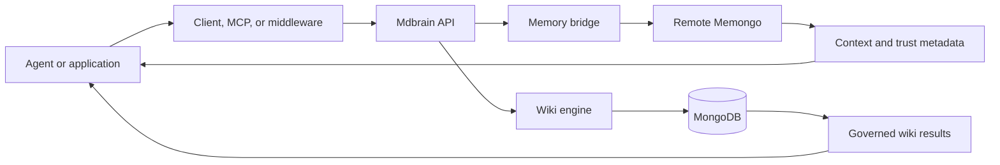

# Features

Active contributors: Rom Iluz

## Purpose

Mdbrain's main capabilities cross deployment and package boundaries. Memory is stored and retrieved through the remote Memongo service, the API enforces caller authority and exposes the product contract, the wiki engine manages synthesized knowledge, and clients deliver the result to agents. These pages trace those flows without repeating each package's internal reference material.

## Capability map

| Capability | What it provides | Start here |
| --- | --- | --- |
| Governed wiki | Scoped pages, evidence-bearing claims, permissions, lifecycle history, contradiction review, links, and transclusion | [Governed wiki](governed-wiki.md) |
| Hybrid retrieval | Vector and lexical retrieval, reciprocal-rank fusion, optional reranking, relationship expansion, and failure fallback | [Hybrid retrieval](hybrid-retrieval.md) |
| Context delivery | Active memory, discovery views, prompt-ready bundles, trust metadata, durable writes, and optional wiki promotion | [Context delivery](context-delivery.md) |
| Agent integrations | TypeScript client, MCP tools, model middleware, console, and demonstration surfaces | [Agent integrations](agent-integrations.md) |

## How the capabilities connect

`apps/api/src/routes/v1.ts` is the meeting point for the HTTP routes. It delegates durable-memory work through `packages/memory-bridge/src/mdbrain-bridge.ts` and wiki work through exports from `packages/wiki-engine/src/index.ts`. `packages/client/src/client.ts`, `apps/mcp/src/server.ts`, and `packages/tools/src/index.ts` adapt that API for application code and agents.

## Integration points

- The [API reference](../api/index.md) describes the HTTP boundary used by all four capabilities.
- The [apps](../apps/index.md) section covers the API, MCP server, and web console as deployable units.
- The [packages](../packages/index.md) section covers implementation ownership and public exports.
- The [security model](../security.md) explains bearer principals, scope grants, capabilities, and permission-changing operations.

## Entry points for modification

Start with the feature page for the user-visible behavior, then follow its key source table to the owning app or package. Changes to an HTTP contract usually touch `apps/api/src/routes/v1.ts`, `apps/api/src/openapi-spec.ts`, and `packages/client/src/client.ts`; changes exposed to agents may also require `apps/mcp/src/server.ts` or `packages/tools/src/index.ts`.

## Key source files

| File | Purpose |
| --- | --- |
| `apps/api/src/routes/v1.ts` | Connects public HTTP operations to memory and wiki capabilities |
| `packages/memory-bridge/src/mdbrain-bridge.ts` | Adapts Mdbrain operations to the remote Memongo gateway |
| `packages/wiki-engine/src/index.ts` | Exports the governed wiki capability surface |
| `packages/client/src/client.ts` | Provides the typed TypeScript API client |
| `apps/mcp/src/server.ts` | Exposes memory and wiki operations as MCP tools |
| `packages/tools/src/index.ts` | Supplies AI SDK-compatible memory tools and middleware exports |
