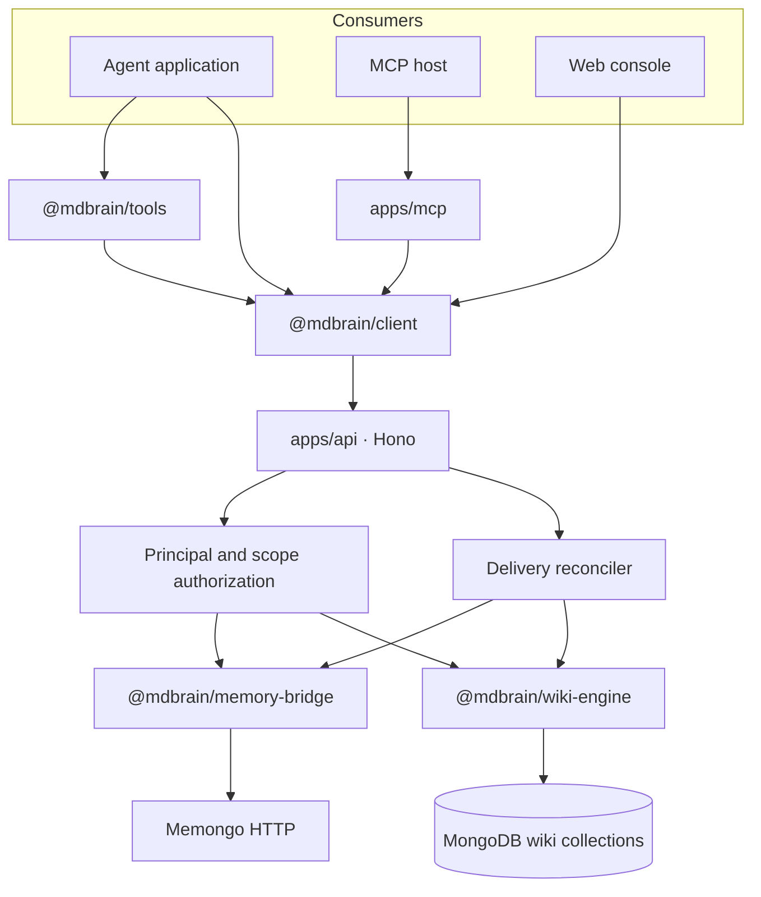
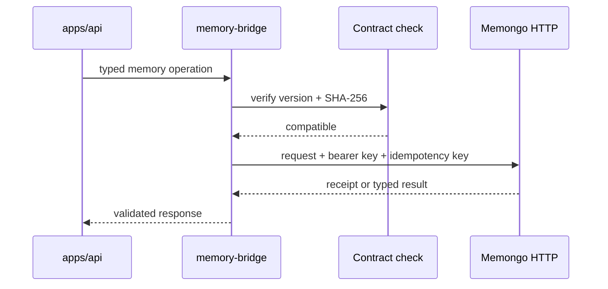
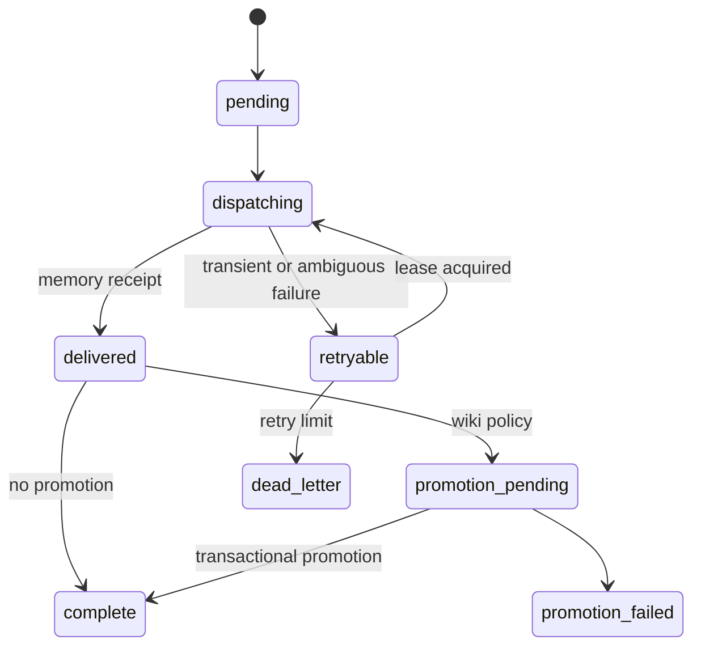

# Architecture

MDBrain separates agent-facing protocols, product orchestration, memory ownership, and wiki ownership. The main runtime path is an HTTP API that routes memory operations to Memongo and wiki operations to a MongoDB-backed engine.

## System topology

`apps/api/src/app.ts` composes CORS, content-type checks, rate limiting, bearer authentication, scoped authorization, health/readiness routes, and the v1 router. `apps/api/src/routes/v1.ts` then dispatches each request to `@mdbrain/memory-bridge` or `@mdbrain/wiki-engine`.

## Memory path

The server-side adapter in `packages/memory-bridge/src/mdbrain-bridge.ts` calls a singleton `MemongoMemoryGateway`. `packages/memory-bridge/src/memongo-http-client.ts` verifies the remote OpenAPI contract, selects the tenant or control credential, attaches idempotency metadata, enforces deadlines, and validates the response against `packages/memory-bridge/src/memongo-gateway-contract.ts`.

Operation-specific method, path, credential, idempotency, and retry rules are centralized in `packages/memory-bridge/src/memongo-operation-policy.ts`. See [Memory bridge](../packages/memory-bridge.md).

## Wiki path

`packages/wiki-engine/src/wiki-store.ts` owns the wiki MongoDB client and transaction boundary. `packages/wiki-engine/src/wiki-schema.ts` creates four collections: wiki pages, revision snapshots, mutation intents, and memory-delivery intents.

Writes pass through `packages/wiki-engine/src/wiki-bridge.ts`. The bridge normalizes the page, records transclusion targets, updates backlinks, runs contradiction detection before near-duplicate rejection, and records a revision snapshot. Reads apply governance through `packages/wiki-engine/src/wiki-governance.ts`.

Search in `packages/wiki-engine/src/wiki-search.ts` can combine Atlas `$vectorSearch`, `$search`, `$rankFusion`, optional `$rerank`, and `$graphLookup`. Search recipes trade latency for depth, while post-retrieval governance remains authoritative.

## Durable delivery

Memory writes that request wiki promotion use an outbox-like state machine. `apps/api/src/memory-delivery-runtime.ts` records and dispatches intents defined in `packages/wiki-engine/src/memory-delivery.ts`. A bounded reconciler retries eligible work with the original idempotency key. Wiki promotion occurs only after a memory receipt.

The implementation has more explicit states than this summary diagram; `MEMORY_DELIVERY_STATES` in `packages/wiki-engine/src/memory-delivery.ts` is the source of truth.

## Deployable units

| Unit | Runtime | Main source |
| --- | --- | --- |
| API | Hono on Node or Cloudflare Workers | `apps/api/src/server.ts` |
| MCP | Model Context Protocol over stdio | `apps/mcp/src/server.ts` |
| Web | Next.js 15 and React 19 through OpenNext | `apps/web/app/layout.tsx` |
| Docs | Mintlify | `apps/docs/docs.json` |

The codebase contains about 50,516 tracked TypeScript lines and 2,352 TSX lines, plus 3,788 CSS lines. Detailed current measurements are in [By the numbers](../by-the-numbers.md).

## External dependencies

- **MongoDB** stores wiki documents, audit intents, and revisions. Atlas Search or Atlas Local is required for vector, hybrid, rerank, and graph-enriched retrieval.
- **Memongo** owns long-term memory and exposes the pinned HTTP contract.
- **Voyage AI through MongoDB Atlas** supplies auto-embeddings and optional reranking when configured.
- **Cloudflare Workers** hosts the API, MCP configuration, and OpenNext web build through `apps/api/wrangler.jsonc`, `apps/mcp/wrangler.jsonc`, and `apps/web/wrangler.jsonc`.
- **Mintlify** renders the product documentation in `apps/docs/`.

See [Security](../security.md) for trust boundaries and [Deployment](../deployment/index.md) for runtime setup.
