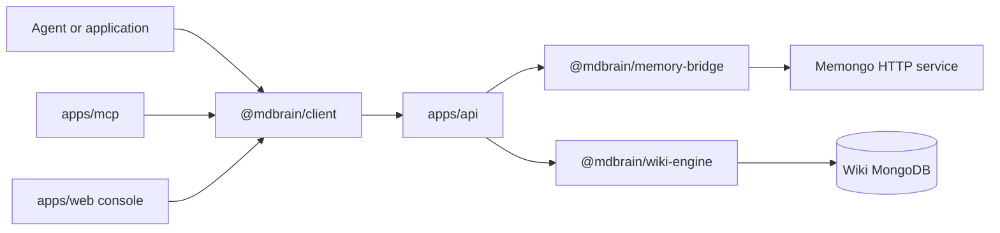

# MDBrain

MDBrain is a MongoDB-native knowledge and memory platform for AI agents. It combines a governed LLM wiki owned by this repository with a version-pinned HTTP gateway to Memongo, which owns long-term memory storage and retrieval.

## What it provides

- A structured wiki whose pages contain claims, evidence, questions, relationships, backlinks, revisions, and lifecycle state. The public engine surface is exported from `packages/wiki-engine/src/index.ts`.
- A Hono HTTP API that exposes memory, lifecycle, context-bundle, wiki, and administration operations through `apps/api/src/app.ts` and `apps/api/src/routes/v1.ts`.
- An MCP adapter with 30 tool definitions in `apps/mcp/src/server.ts`.
- A typed HTTP client in `packages/client/src/client.ts` and AI SDK integrations in `packages/tools/src/index.ts`.
- A Next.js operator console and public product site under `apps/web/app/`.
- Mintlify product documentation under `apps/docs/`.

The repository is a Bun and Turborepo monorepo. MongoDB owns the wiki collections, while the separate Memongo service is consumed only through the captured HTTP contract in `docs/contracts/memongo/2.0.1/`.

## Start here

| Goal | Page |
| --- | --- |
| Understand the runtime topology | [Architecture](architecture.md) |
| Run the project locally | [Getting started](getting-started.md) |
| Learn project vocabulary | [Glossary](glossary.md) |
| Find a deployable application | [Apps](../apps/index.md) |
| Find a published library | [Packages](../packages/index.md) |
| Trace a user-visible capability | [Features](../features/index.md) |
| Call the HTTP or MCP surface | [API](../api/index.md) |
| Contribute safely | [How to contribute](../how-to-contribute/index.md) |

## Supported surfaces

The supported product surface is `apps/api`, `apps/mcp`, `apps/web`, `apps/docs`, `packages/wiki-engine`, `packages/memory-bridge`, `packages/client`, `packages/tools`, and `packages/mdbrain-memory`, as recorded in `CONTRIBUTING.md`. `packages/lib` is shared runtime support.

Memory and wiki storage have separate ownership:



The API does not import a memory database engine. `packages/memory-bridge/src/memongo-runtime.ts` pins Memongo contract version 2.0.1 and its OpenAPI digest before the gateway accepts traffic.

## Repository map

```text
apps/
  api/                  Hono HTTP API and delivery reconciler
  mcp/                  stdio MCP adapter
  web/                  Next.js console, marketing site, and demos
  docs/                 Mintlify product documentation
packages/
  wiki-engine/          Governed wiki storage and retrieval
  memory-bridge/        Pinned Memongo HTTP gateway
  client/               Public TypeScript HTTP client
  tools/                AI SDK tools and middleware
  mdbrain-memory/       Convenience re-export package
  lib/                  Shared types and utilities
scripts/                Proof, evaluation, release, and maintenance tools
docker/                 Local MongoDB and Atlas Local stacks
```

For the detailed component and request flows, continue to [Architecture](architecture.md).
