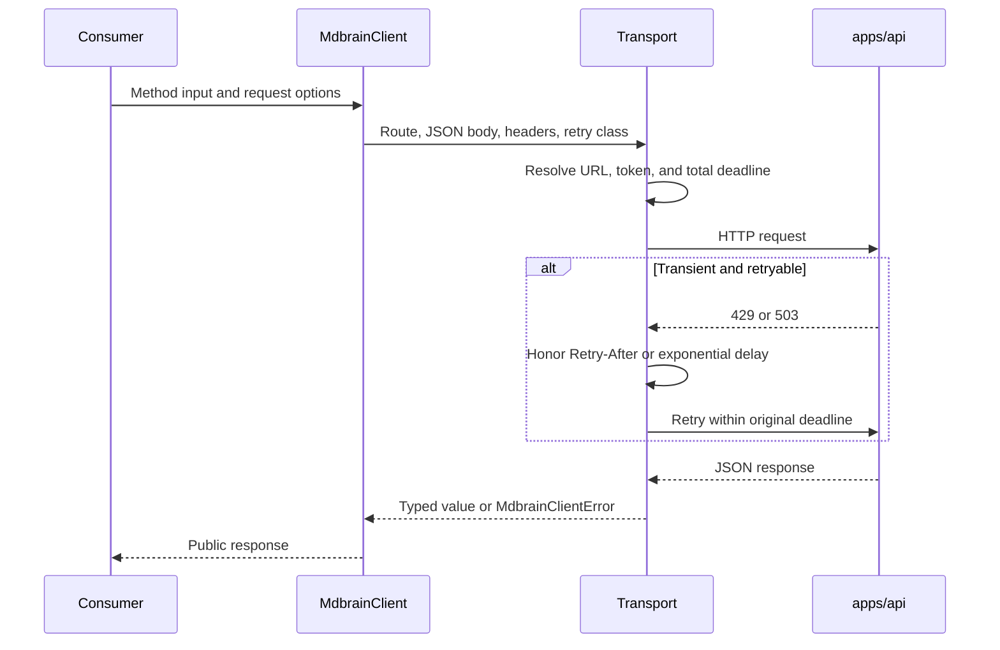

# TypeScript client

Active contributors: Rom Iluz

## Purpose

`@mdbrain/client` is the public TypeScript HTTP SDK for MDBrain. It has no runtime package dependencies and wraps the supported memory, lifecycle, context, and wiki routes exposed by `apps/api`.

Use the client in applications, jobs, the web console, or MCP adapters. Trusted code that must call Memongo directly through the pinned upstream contract should use [`@mdbrain/memory-bridge`](memory-bridge.md) instead.

## Directory layout

```text
packages/client/
├── src/
│   ├── index.ts       Public exports
│   ├── client.ts      MdbrainClient methods
│   ├── transport.ts   HTTP, deadline, and retry behavior
│   └── types.ts       Public request and response types
├── type-tests/
│   └── public-exports.ts
└── package.json
```

## Key abstractions

`MdbrainClient` groups methods by public API operation. `MdbrainClientOptions` configures the base URL, bearer token, retry count, and default deadline. `MdbrainRequestOptions` adds a per-call deadline override and caller cancellation. `MdbrainClientError` carries HTTP status and response text, with `DEADLINE_EXCEEDED` and `REQUEST_ABORTED` codes for local cancellation paths.

The transport resolves values in this order:

| Setting | Explicit option | Environment fallback | Default |
| --- | --- | --- | --- |
| API URL | `baseUrl` | `MDBRAIN_API_URL` | `http://127.0.0.1:3847` |
| Bearer token | `apiKey` | `MDBRAIN_API_KEY` | No authorization header |
| Total deadline | Per-call `timeoutMs`, then `defaultDeadlineMs` | None | 10,000 ms |
| Maximum retries | `maxRetries` | None | 2 |

The package models the JSON wire format. Date-like values in public response types are strings, not server-side `Date` objects.

## Supported method groups

| Group | Representative methods |
| --- | --- |
| Conversation memory | `add`, `writeEvent`, `recallConversation`, `extract` |
| Retrieval | `search`, `searchDetailed`, `searchKB`, `profile` |
| Context | `hydrateActiveSlate`, `state`, `buildDiscoveryProjection`, `buildContextBundle` |
| Lifecycle | `getLifecycleItem`, `updateLifecycleItem`, `deleteLifecycleItem`, `getLifecycleHistory` |
| Feedback | `reportProcedureOutcome`, `applyMemoryFeedback` |
| Structured memory | `writeStructured`, `writeProcedure` |
| Wiki | `wikiSearch`, `wikiGet`, `wikiApply`, `wikiDelete`, `wikiLint`, `wikiExportOkf`, `wikiImportOkf` |

The wiki methods currently return `unknown` where the client has not established a public response type. `wikiApply` attempts creation first and, on HTTP 409, patches the existing slug with the remaining original deadline.

## How it works



Safe reads retry transient transport failures, response-read failures, HTTP 429, and HTTP 503 while time remains. `add` and `writeEvent` use the same retry behavior because the caller must provide an idempotency key that is reused with the unchanged body. Mutating methods without that guarantee use the `never` retry policy.

`Retry-After` accepts either seconds or an HTTP date. Otherwise the transport uses exponential delays starting at 200 ms. All attempts and waits share one total deadline; caller cancellation also covers retry waits.

## Integration points

- `apps/mcp/src/server.ts` uses `MdbrainClient` to implement the [MCP application](../apps/mcp.md).
- `apps/web/app/console/page.tsx` uses the client from the [web application](../apps/web.md) operator console.
- [`@mdbrain/tools`](tools.md) accepts an `MdbrainClient` when constructing model-callable tools.
- `apps/api/src/routes/v1.ts` is the server route surface corresponding to the client's [API](../api/index.md) calls.

See [Features](../features/index.md) for retrieval and lifecycle behavior, [Security](../security.md) for bearer-token handling, and [Reference](../reference/index.md) for route and configuration details.

## Entry points for modification

- Add or change methods in `packages/client/src/client.ts`, assigning an explicit `safe`, `same-key`, or `never` retry class.
- Add reusable request and response shapes in `packages/client/src/types.ts`. Keep wire dates as strings and avoid exporting types for unsupported routes.
- Change deadlines, cancellation, headers, or retry behavior in `packages/client/src/transport.ts`.
- Re-export every intended public symbol from `packages/client/src/index.ts` and update `packages/client/type-tests/public-exports.ts`.
- Add behavior tests in `packages/client/src/client.test.ts`, especially for route construction, retry boundaries, idempotency headers, and deadline sharing.

## Key source files

| File | Purpose |
| --- | --- |
| `packages/client/src/client.ts` | `MdbrainClient`, method routing, and response types close to methods |
| `packages/client/src/transport.ts` | Base URL and token resolution, HTTP helpers, deadlines, cancellation, retries, and errors |
| `packages/client/src/types.ts` | Public input and JSON response types |
| `packages/client/src/index.ts` | Supported package export surface |
| `packages/client/type-tests/public-exports.ts` | Compile-time checks for public exports |
| `packages/client/src/client.test.ts` | Transport and client behavior coverage |
