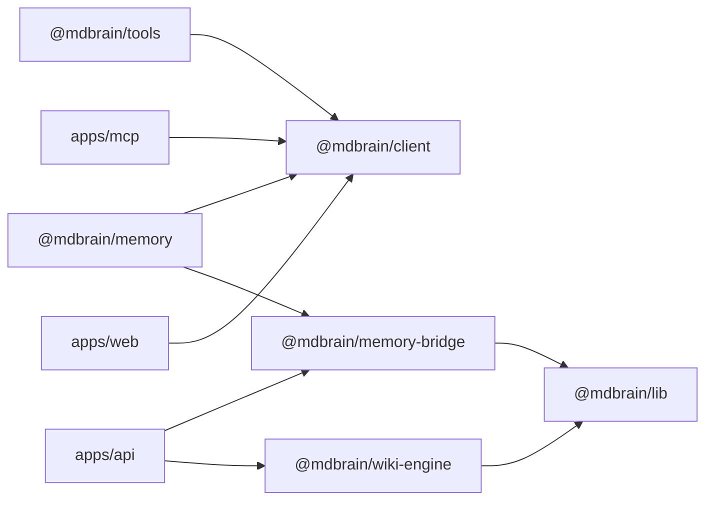

# Packages

Active contributors: Rom Iluz

## Purpose

MDBrain publishes a small set of TypeScript packages around two boundaries: trusted server code reaches Memongo through `@mdbrain/memory-bridge`, while applications and integrations reach MDBrain through `@mdbrain/client`. `@mdbrain/tools` adds agent-framework adapters, `@mdbrain/wiki-engine` owns the governed wiki domain, and `@mdbrain/lib` supplies shared types and runtime utilities.

## Directory layout

```text
packages/
├── memory-bridge/   Pinned Memongo HTTP gateway
├── wiki-engine/     Governed wiki engine
├── client/          Public TypeScript HTTP client
├── tools/           AI SDK tools and middleware
├── mdbrain-memory/  Convenience re-export package
└── lib/             Shared types and utilities
```

## Package map

| Package | Role | Primary consumers |
| --- | --- | --- |
| [`@mdbrain/memory-bridge`](memory-bridge.md) | Version-pinned Memongo 2.0.1 HTTP gateway and MDBrain compatibility adapter | `apps/api` and other trusted server runtimes |
| [`@mdbrain/wiki-engine`](wiki-engine/index.md) | Governed wiki storage, retrieval, revision, and interchange engine | `apps/api` and maintenance tooling |
| [`@mdbrain/client`](client.md) | Zero-runtime-dependency TypeScript client for the public MDBrain HTTP API | `apps/mcp`, `apps/web`, and external applications |
| [`@mdbrain/tools`](tools.md) | Vercel AI SDK tools plus Vercel and OpenAI-compatible model middleware | Agent applications |
| [`@mdbrain/lib`](lib.md) | Shared configuration types, security helpers, retries, logging, and other utilities | MDBrain packages and applications |

`@mdbrain/memory` is a convenience package whose entry point re-exports `@mdbrain/memory-bridge` and `@mdbrain/client`.
Use the direct packages when a consumer needs only the server gateway or only the public HTTP client.

## How it works



The client package deliberately has no runtime package dependencies. The tools package adds `zod` and a peer dependency on AI SDK 5, while the bridge depends on the shared library. Keep application-only behavior out of these published packages so each package remains usable at its intended boundary.

## Choose an entry point

- Use `@mdbrain/client` to call the supported HTTP surface described in [API](../api/index.md).
- Use `@mdbrain/tools` to expose memory operations to a model or to inject memory around model calls. See [Features](../features/index.md) for the user-visible retrieval and memory flows.
- Use `@mdbrain/memory-bridge` only in trusted server code that can hold Memongo credentials. See the [API application](../apps/api.md) and [Security](../security.md) for the surrounding trust boundary.
- Use `@mdbrain/wiki-engine` for repository-owned wiki storage and governance, not for Memongo-backed memory.
- Use `@mdbrain/lib` when another workspace package needs an existing shared primitive; it is not the primary application integration surface.

## Integration points

The [API application](../apps/api.md) imports the bridge, wiki engine, and shared library. The [MCP application](../apps/mcp.md) and [web application](../apps/web.md) consume the client. Agent applications compose the client with `@mdbrain/tools`.

## Entry points for modification

Preserve the distinction between wire-facing and server-facing types. The client models JSON dates as strings, while server-side bridge types may use `Date`. Add Memongo operations through the bridge's policy and contract tables, add public HTTP methods through the client transport, and add model tools only after the client supports the operation.

Package versions and export maps live in each package's `package.json`. The [Reference](../reference/index.md) pages describe configuration and supported interfaces.

## Key source files

| File | Purpose |
| --- | --- |
| `packages/memory-bridge/src/mdbrain-bridge.ts` | Public server-side memory adapter |
| `packages/wiki-engine/src/index.ts` | Public wiki-engine exports |
| `packages/client/src/index.ts` | Public client exports |
| `packages/tools/src/index.ts` | Tool factory and middleware exports |
| `packages/lib/src/index.ts` | Shared utility export surface |
| `packages/mdbrain-memory/src/index.ts` | Convenience re-export of the bridge and client |
