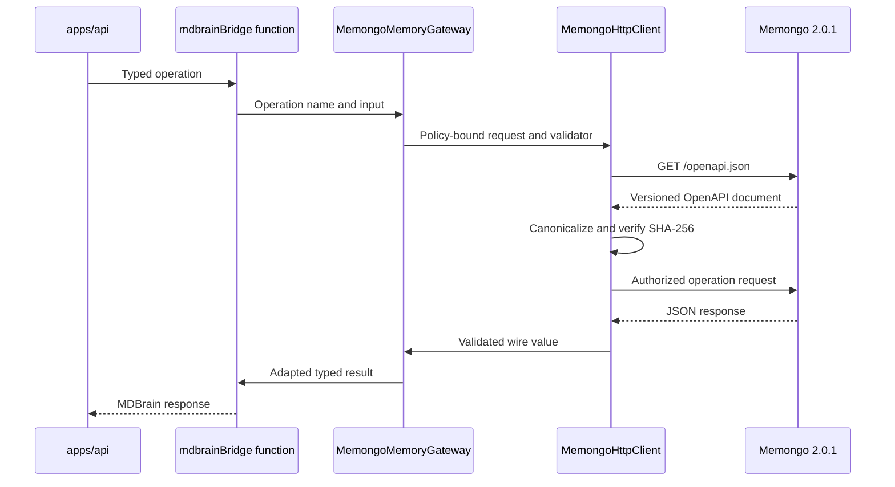

# Memory bridge

Active contributors: Rom Iluz

## Purpose

`@mdbrain/memory-bridge` is the trusted server-side boundary between MDBrain and Memongo. It pins the accepted Memongo contract to version `2.0.1`, checks the canonical OpenAPI SHA-256 digest before operations, and exposes typed MDBrain functions instead of Memongo storage internals.

Applications that call the public MDBrain API should use [`@mdbrain/client`](client.md). The bridge holds upstream tenant and control credentials and therefore belongs behind the [API application](../apps/api.md), not in browsers or untrusted clients.

## Directory layout

```text
packages/memory-bridge/
├── src/
│   ├── mdbrain-bridge.ts              Public compatibility adapter
│   ├── memongo-runtime.ts             Pinned runtime and readiness
│   ├── memongo-http-client.ts         HTTP and contract boundary
│   ├── memongo-operation-policy.ts    Operation policy table
│   ├── memongo-gateway-contract.ts    Wire validators and adapters
│   ├── memongo-memory-gateway.ts      Typed gateway
│   ├── memory-contract-types.ts       Memory lifecycle types
│   └── mdbrain-export.ts              Deterministic signed exports
└── package.json
```

## Key abstractions

| Abstraction | Responsibility |
| --- | --- |
| `MemongoHttpClient` | Validates the base URL, verifies compatibility, selects credentials, applies deadlines, sends HTTP requests, and maps failures to `MemongoHttpError` |
| `MEMONGO_OPERATION_POLICIES` | Defines each operation's method, path, read/write kind, credential lane, idempotency mode, and retry classification |
| `RETAINED_OPERATION_DEFINITIONS` | Defines body or query transport, response validation, and adaptation into gateway return values |
| `MemongoMemoryGateway` | Executes retained operations and composes compatibility, retrieval, and optional control-plane readiness checks |
| `mdbrainBridge*` functions | Present the stable MDBrain-facing API for search, context, writes, lifecycle operations, feedback, and status |
| Export bundle helpers | Canonicalize JSON-compatible and selected non-JSON values, sign bundles with HMAC-SHA256, and verify signatures in constant time |

The runtime singleton resolves `MEMONGO_API_URL` and `MEMONGO_API_KEY`, with optional `MEMONGO_CONTROL_API_KEY`. It also pins `MEMONGO_CONTRACT_VERSION` and `MEMONGO_CONTRACT_SHA256` in `packages/memory-bridge/src/memongo-runtime.ts`.

## How it works



Compatibility results are cached for `MEMONGO_COMPATIBILITY_TTL_MS`, which defaults to 60 seconds. Concurrent default compatibility checks share one in-flight promise. The client rejects credential-bearing URLs and requires HTTPS, except when `MEMONGO_ALLOW_INSECURE_LOCAL=1` explicitly permits a loopback HTTP URL.

## Operation and failure policy

Read operations use tenant credentials and are classified as transient-retryable. `status`, `embeddingProbe`, and `vectorProbe` use the optional control credential. The operation policy is the source of truth for whether an operation accepts a body or query, requires idempotency, and can be retried.

`add` and `writeEvent` require an `Idempotency-Key` and classify a retry as safe only with the same key. `writeEvents` uses per-item idempotency. Other writes are not classified as retryable. The HTTP client does not perform a retry loop itself; it reports `retryable`, `retryAfterMs`, and write outcome information so the caller can make a policy-aware decision.

`MemongoHttpError` separates failure code, HTTP status, retryability, and write outcome. A timeout, cancellation, malformed response, network failure, or upstream 5xx after a write may produce an `unknown` outcome. Callers must not treat that state as proof that the write was not applied.

## Readiness and response validation

Readiness always verifies the contract and a retrieval request through `/v1/state`. Deployments may additionally require `control`, `embedding`, or `vector` lanes through `MEMONGO_READINESS_CONTROL_LANES`. A lane failure is wrapped in `MemongoReadinessError` with the failing dependency.

Every retained operation has a response predicate in `packages/memory-bridge/src/memongo-gateway-contract.ts`. The gateway rejects malformed JSON and structurally incompatible responses before adapting envelopes such as `{ results }` or `{ receipts }` into MDBrain return values.

## Signed export bundles

`packages/memory-bridge/src/mdbrain-export.ts` creates deterministic export bytes by recursively sorting object keys while preserving array order. It normalizes `Date`, binary data, `Map`, `Set`, and selected BSON values into tagged JSON objects, then signs the canonical bytes with HMAC-SHA256. Callers remain responsible for supplying arrays in stable order and for protecting `MDBRAIN_EXPORT_SIGNING_KEY`.

The package's public `"."` export is built from `packages/memory-bridge/src/mdbrain-bridge.ts`; the export-bundle module is an internal source module rather than a re-export from that entry point.

## Integration points

- `apps/api/src/routes/v1.ts` maps the public [API](../api/index.md) to bridge functions.
- `apps/api/src/app.ts` includes bridge readiness in application startup and readiness handling.
- `apps/api/src/memory-delivery-runtime.ts` uses idempotent bridge writes before wiki promotion.
- `packages/memory-bridge/src/mdbrain-bridge.ts` imports shared scope types from [`@mdbrain/lib`](lib.md).
- `docs/contracts/memongo/2.0.1/openapi.json` is the captured upstream contract whose canonical digest is pinned by the runtime.

See [Features](../features/index.md) for the capabilities built on these operations, [Security](../security.md) for credential and transport boundaries, and [Reference](../reference/index.md) for environment configuration.

## Entry points for modification

- Add or change a Memongo operation in `packages/memory-bridge/src/memongo-operation-policy.ts` and `packages/memory-bridge/src/memongo-gateway-contract.ts` together. Keep method, credential, idempotency, transport, validator, and adapter definitions aligned.
- Add the MDBrain-facing function in `packages/memory-bridge/src/mdbrain-bridge.ts` only after the operation policy and wire contract exist.
- Change the pinned version or digest in `packages/memory-bridge/src/memongo-runtime.ts` only with a reviewed capture under `docs/contracts/memongo/`.
- Extend error mapping and transport safeguards in `packages/memory-bridge/src/memongo-http-client.ts`; preserve unknown-outcome semantics for ambiguous writes.
- Update deterministic export normalization in `packages/memory-bridge/src/mdbrain-export.ts` with matching round-trip, ordering, and signature tests.

## Key source files

| File | Purpose |
| --- | --- |
| `packages/memory-bridge/src/mdbrain-bridge.ts` | Public MDBrain compatibility functions and server-side types |
| `packages/memory-bridge/src/memongo-runtime.ts` | Environment resolution, pinned contract identity, singleton gateway, and readiness |
| `packages/memory-bridge/src/memongo-http-client.ts` | Secure transport, compatibility checks, deadlines, credentials, and typed failures |
| `packages/memory-bridge/src/memongo-operation-policy.ts` | Central method, path, credential, idempotency, and retry policy |
| `packages/memory-bridge/src/memongo-gateway-contract.ts` | Retained operation inputs, outputs, validators, and response adapters |
| `packages/memory-bridge/src/memongo-memory-gateway.ts` | Gateway execution and readiness orchestration |
| `packages/memory-bridge/src/memory-contract-types.ts` | Lifecycle, structured-memory, procedure, recall, and provider-status types |
| `packages/memory-bridge/src/mdbrain-export.ts` | Canonical export serialization, signing, and verification |
| `docs/contracts/memongo/2.0.1/openapi.json` | Captured Memongo 2.0.1 OpenAPI contract |
