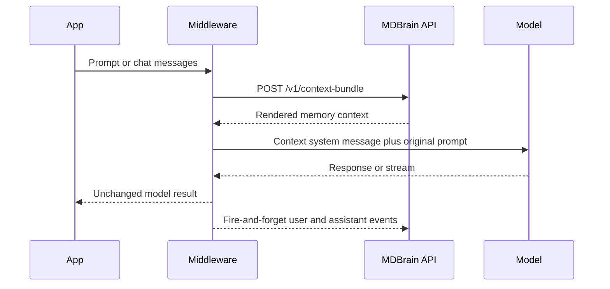

# AI SDK tools and middleware

Active contributors: Rom Iluz

## Purpose

`@mdbrain/tools` adapts the public MDBrain HTTP client to model runtimes. It provides 14 Vercel AI SDK tools, Vercel language-model middleware, and a wrapper for OpenAI-compatible `chat.completions.create()` clients.

The package depends on [`@mdbrain/client`](client.md) and `zod`, with AI SDK 5 or later as a peer dependency. It does not connect to Memongo directly.

## Directory layout

```text
packages/tools/
├── src/
│   ├── index.ts          Tool factory and public exports
│   ├── write-event.ts    Asynchronous event persistence
│   ├── vercel/index.ts   Vercel AI SDK middleware
│   └── openai/index.ts   OpenAI-compatible middleware
└── package.json
```

## Key abstractions

| Abstraction | Responsibility |
| --- | --- |
| `createMdbrainTools` | Builds the validated 14-tool set around a supplied `MdbrainClient` |
| `withMdbrain` | Wraps an AI SDK `LanguageModelV2` with context injection and event persistence |
| `createOpenAIMiddleware` | Proxies OpenAI-compatible chat completions without a runtime OpenAI dependency |
| `fireWriteEvent` | Dispatches non-blocking, idempotent conversation-event writes |

### Tool catalog

`createMdbrainTools(client)` returns a `Record<string, Tool>` whose schemas validate model-generated arguments before calling the supplied `MdbrainClient`.

| Tool group | Tool names |
| --- | --- |
| Retrieval | `mdbrain_search`, `mdbrain_search_kb`, `mdbrain_recall_conversation` |
| Writes | `mdbrain_add`, `mdbrain_write_event` |
| Context | `mdbrain_profile`, `mdbrain_build_context_bundle`, `mdbrain_state_unified` |
| Lifecycle | `mdbrain_lifecycle_get`, `mdbrain_lifecycle_update`, `mdbrain_lifecycle_delete`, `mdbrain_lifecycle_history` |
| Feedback | `mdbrain_procedure_outcome`, `mdbrain_memory_feedback` |

Lifecycle schemas require stable handles and distinguish structured-memory patches from procedure patches. The feedback schema also enforces signal-specific input: `correct` requires a patch, while `confirm` and `irrelevant` have their own shapes.

## How it works

Both middleware adapters request `/v1/context-bundle`, inject the returned `rendered` text as a leading `[Memory Context]` system message, and continue without injected context if the request fails or returns no text.



`withMdbrain(model, options)` wraps an AI SDK `LanguageModelV2`. It supports generated and streamed responses, collecting text deltas and writing the completed assistant text after a stream closes. Its context cache holds at most 50 entries for 60 seconds and keys entries by user plus a hash of the query.

`createOpenAIMiddleware(client, options)` proxies an OpenAI-compatible client without importing the OpenAI package. It records assistant text for non-streaming completions. For streaming OpenAI calls, it injects context but cannot intercept chunks to persist the assistant response; call `writeEvent` explicitly or use the Vercel middleware when automatic streamed-response persistence is required.

When a user query is available, middleware defaults to a full context bundle unless `mode` is `wake-up`. Without a query, it defaults to the compact wake-up mode.

## Asynchronous write behavior

User and assistant events are fire-and-forget and never change or reject the model result. Each logical event receives a new UUID idempotency key. A failed write is attempted at most twice, reusing that key and request body; network failures, HTTP 408, HTTP 429, and HTTP 5xx responses qualify for the second attempt.

After both attempts fail, `onWriteError` receives a sanitized `MdbrainWriteFailure` containing role, failure kind, optional status, generic code and message, and attempt count. It does not include response bodies, credentials, or message content. If the callback is absent or throws, the implementation writes the sanitized failure to `console.warn`.

## Integration points

- Agent applications pass a configured `MdbrainClient` to `createMdbrainTools`.
- Vercel AI SDK applications import `withMdbrain` from `@mdbrain/tools` or `@mdbrain/tools/vercel`.
- OpenAI-compatible applications import `createOpenAIMiddleware` from `@mdbrain/tools` or `@mdbrain/tools/openai`.
- All reads and writes cross the public [API](../api/index.md); API authentication and scope enforcement remain server responsibilities.

See [Features](../features/index.md) for memory retrieval and context composition, [Apps](../apps/index.md) for deployable consumers, [Security](../security.md) for credential boundaries, and [Reference](../reference/index.md) for integration configuration.

## Entry points for modification

- Add a model-callable operation in `packages/tools/src/index.ts` only after `MdbrainClient` exposes the supported API method. Define a bounded Zod schema and keep the tool description aligned with server behavior.
- Change AI SDK prompt transformation, context caching, or stream collection in `packages/tools/src/vercel/index.ts`.
- Change OpenAI proxy behavior in `packages/tools/src/openai/index.ts`; preserve all non-`create` properties through `Reflect.get`.
- Change event retry or failure-observer behavior in `packages/tools/src/write-event.ts`. Preserve per-event idempotency keys and do not expose message bodies or credentials in failures.
- Update focused tests in `packages/tools/src/index.test.ts`, `packages/tools/src/vercel/index.test.ts`, and `packages/tools/src/openai/index.test.ts`.

## Key source files

| File | Purpose |
| --- | --- |
| `packages/tools/src/index.ts` | Tool schemas, 14-tool factory, and public middleware re-exports |
| `packages/tools/src/vercel/index.ts` | Vercel AI SDK middleware, context cache, and stream handling |
| `packages/tools/src/openai/index.ts` | OpenAI-compatible client proxy and context injection |
| `packages/tools/src/write-event.ts` | Fire-and-forget event persistence, retries, and sanitized failure reporting |
| `packages/tools/package.json` | Package exports, runtime dependencies, and AI SDK peer range |
