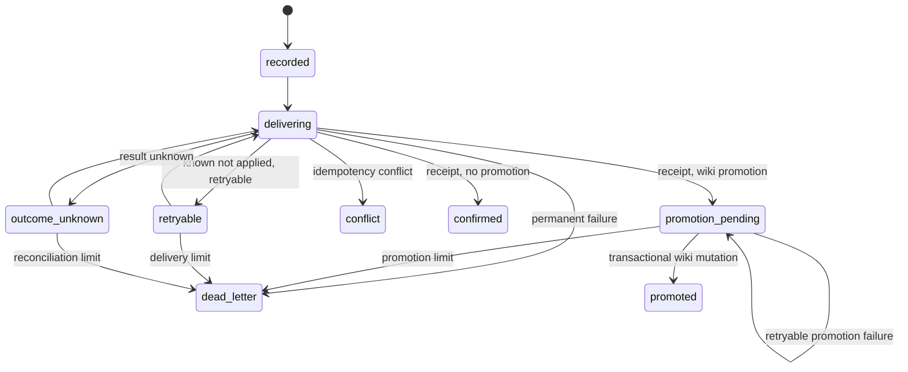

# Delivery intents

Active contributors: Rom Iluz

## Purpose

Memory delivery intents make API memory writes recoverable across transient errors, ambiguous outcomes, and process restarts. `packages/wiki-engine/src/memory-delivery.ts` owns the durable ledger and state transitions. `apps/api/src/memory-delivery-runtime.ts` performs Memongo dispatch, retries, and optional wiki promotion.

This is a cross-package protocol: the ledger is stored with MDBrain-owned wiki data, but the memory payload is delivered through the [memory bridge](../memory-bridge.md).

## Intent identity and replay

The API derives `operationId` by hashing the principal subject, scope, scope reference, operation, and idempotency key in `apps/api/src/memory-delivery-runtime.ts`. `recordMemoryDeliveryIntent()` separately fingerprints the canonical payload and records:

- operation and original idempotency key;
- payload and its SHA-256 fingerprint;
- principal, agent, scope, and scope reference;
- promotion policy;
- state, attempt counters, timestamps, receipt, and last error;
- replay conflict count, fields, and time.

Replaying the same operation ID with matching identity and payload returns the existing intent. A mismatch records the exact conflicting fields and returns `conflict: true`; the API rejects dispatch. The update preserves the intent's current state, while an idempotency conflict reported during dispatch can transition it to the terminal `conflict` state.

## State machine

The code uses `outcome-unknown` and `promotion-pending` as stored values; underscores in the diagram are Mermaid state identifiers.

`beginMemoryDelivery()` claims eligible work with an atomic state predicate. A fresh `delivering` lease rejects another claimant. A stale lease becomes `outcome-unknown`; delivery and reconciliation attempts are bounded. `confirmMemoryDelivery()` stores the receipt and chooses `confirmed` or `promotion-pending`. `failMemoryDelivery()` maps failure knowledge and retryability to the next state.

## Dispatch and reconciliation

`deliverMemoryWrite()` in `apps/api/src/memory-delivery-runtime.ts` records the intent transactionally, claims it, dispatches to `mdbrainBridgeAdd()` or `mdbrainBridgeWriteConversationEvent()`, then records the result in another transaction. The remote HTTP request cannot be part of the MongoDB transaction, so the idempotency key and `outcome-unknown` state are what make reconciliation safe.

`reconcileMemoryDeliveriesOnce()` lists intents in `recorded`, `delivering`, `retryable`, `outcome-unknown`, and `promotion-pending`, applies bounded exponential delay, reconstructs the original dispatch, and tries again. `startMemoryDeliveryReconciler()` runs that pass on an unref'd timer with a minimum one-second interval.

## Wiki promotion

When `promotionPolicy` is `wiki`, `buildMemoryWikiPromotion()` validates the requested page against the memory scope and the caller's trust and permission capabilities. Promotion is allowed only after a confirmed receipt. It adds the returned memory event ID as claim evidence and provenance, creates the wiki page, records a wiki mutation intent, and marks delivery `promoted` in one MongoDB transaction.

The promotion key is stable for the operation and page slug. Repeating a completed promotion with the same key is accepted; a different key raises `MemoryDeliveryConflictError`. Promotion failures remain pending until the configured attempt limit, then become `dead-letter`.

## Security and data exposure

`listMemoryDeliveryIntents()` returns full stored records to internal callers. The API's administrative list route removes the payload, idempotency key, payload fingerprint, and principal subject before responding in `apps/api/src/routes/v1.ts`. Authorization and capability checks are described in [Security](../../security.md).

## Integration points

The collection and indexes are described in [Schema and storage](schema-and-storage.md). Wiki promotion uses [Pages and history](pages-and-history.md) and its mutation evidence. The [API app](../../apps/api.md) owns runtime scheduling and remote dispatch, while the [Features](../../features/index.md) section covers the end-user memory and promotion flows.

## Entry points for modification

Change state transitions and replay comparison in `packages/wiki-engine/src/memory-delivery.ts`. Change operation ID generation, failure classification, dispatch reconstruction, promotion validation, or reconciliation scheduling in `apps/api/src/memory-delivery-runtime.ts`. Keep remote dispatch outside MongoDB transactions and retain the original idempotency key for every retry.

## Key source files

| File | Purpose |
| --- | --- |
| `packages/wiki-engine/src/memory-delivery.ts` | Intent model, fingerprinting, transitions, promotion, and listing |
| `packages/wiki-engine/src/wiki-schema.ts` | Delivery validator and indexes |
| `apps/api/src/memory-delivery-runtime.ts` | Dispatch, promotion construction, and reconciler |
| `apps/api/src/routes/v1.ts` | Memory write and administrative delivery routes |
| `packages/memory-bridge/src/mdbrain-bridge.ts` | Typed bridge operations used for remote delivery |
| `packages/wiki-engine/src/wiki-mutation-intents.ts` | Audit evidence recorded during wiki promotion |
