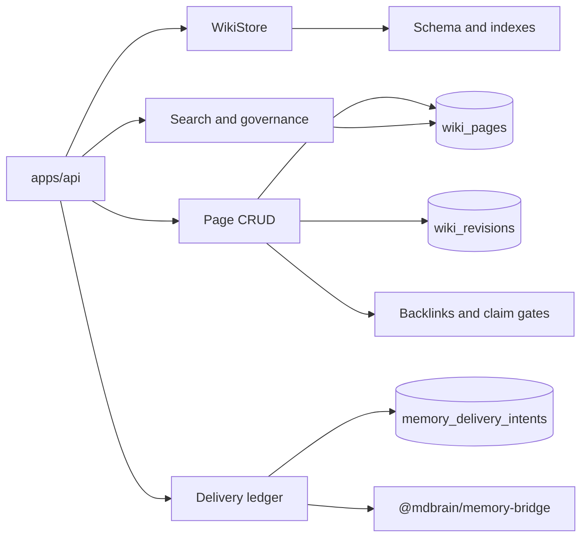

# Wiki engine

Active contributors: Rom Iluz

## Purpose

`@mdbrain/wiki-engine` owns MDBrain's MongoDB-backed wiki. It provides page storage, revision history, governed retrieval, hybrid search, integrity maintenance, Open Knowledge Format interchange, connector contracts, and durable delivery records. The public package surface is assembled in `packages/wiki-engine/src/index.ts`.

The package does not own long-term memory storage. Memory requests go through the [memory bridge](../memory-bridge.md), while the [API app](../../apps/api.md) decides whether a request is a memory operation, a wiki operation, or a memory write followed by wiki promotion.

## Directory layout

```text
packages/wiki-engine/
├── src/
│   ├── index.ts                    Public exports
│   ├── wiki-store.ts               MongoDB connection and transactions
│   ├── wiki-schema.ts              Collections, validation, and indexes
│   ├── wiki-bridge.ts              Page CRUD and rendering facade
│   ├── wiki-revisions.ts           Full page snapshots
│   ├── wiki-search.ts              Vector, text, and graph retrieval
│   ├── wiki-governance.ts          Scope and permission filters
│   ├── wiki-maintenance.ts         Git-diff and Dreamer maintenance
│   ├── okf.ts                      OKF import and export
│   ├── wiki-connectors.ts          Source connector interfaces
│   └── memory-delivery.ts          Durable memory delivery ledger
└── package.json
```

## Key abstractions

| Abstraction | Source | Role |
| --- | --- | --- |
| `WikiStore` | `packages/wiki-engine/src/wiki-store.ts` | Owns the MongoDB client, schema initialization, handles, and transaction sessions |
| `WikiPageInput` and `WikiPageView` | `packages/wiki-engine/src/wiki-bridge.ts` | Define caller input and the embedding-free page returned to consumers |
| `GovernanceContext` | `packages/wiki-engine/src/wiki-governance.ts` | Carries the server-derived scope, trust tier, identity, groups, roles, and departments used on reads |
| `WikiSearchParams` | `packages/wiki-engine/src/wiki-search.ts` | Selects a retrieval recipe, filters, reranking, and graph expansion |
| `SourceConnector` | `packages/wiki-engine/src/wiki-connectors.ts` | Defines authentication, discovery, ingestion, and permission mapping for external sources |
| `MemoryDeliveryIntent` | `packages/wiki-engine/src/memory-delivery.ts` | Records retryable memory delivery and optional wiki promotion state |

## How it works



`WikiStore.initialize()` connects and runs `ensureWikiSchema()` before exposing a handle. Page writes through `packages/wiki-engine/src/wiki-bridge.ts` normalize persisted fields, maintain graph metadata, run claim checks, and capture revisions. The API wraps externally initiated mutations and delivery transitions in MongoDB transactions through `apps/api/src/wiki-store-runtime.ts`.

## Package guides

- [Schema and storage](schema-and-storage.md) covers the four collections, validators, indexes, and store lifecycle.
- [Pages and history](pages-and-history.md) covers CRUD, rendering, backlinks, transclusion, revisions, and mutation audit records.
- [Search and governance](search-and-governance.md) covers retrieval recipes and read authorization.
- [Maintenance and integrity](maintenance-and-integrity.md) covers regeneration, promotion, contradictions, and repair helpers.
- [OKF and connectors](okf-and-connectors.md) covers portable bundles and source adapters.
- [Delivery intents](delivery-intents.md) covers reliable Memongo writes and optional wiki promotion.

For HTTP routes and principal construction, see the [API app](../../apps/api.md). For user-visible workflows spanning packages, see [Features](../../features/index.md). Trust boundaries and filesystem controls are summarized in [Security](../../security.md).

## Entry points for modification

Start in `packages/wiki-engine/src/index.ts` when changing the public API. Use `packages/wiki-engine/src/wiki-bridge.ts` for page behavior, `packages/wiki-engine/src/wiki-schema.ts` for persistence contracts, and the focused module for search, maintenance, OKF, connectors, or delivery behavior. Add colocated Vitest coverage before changing a public contract.

## Key source files

| File | Purpose |
| --- | --- |
| `packages/wiki-engine/src/index.ts` | Public package exports and version |
| `packages/wiki-engine/src/wiki-store.ts` | Connection and transaction owner |
| `packages/wiki-engine/src/wiki-schema.ts` | MongoDB schemas and indexes |
| `packages/wiki-engine/src/wiki-bridge.ts` | Main page facade |
| `packages/wiki-engine/src/wiki-search.ts` | Search aggregation pipelines |
| `packages/wiki-engine/src/wiki-governance.ts` | Governed read filters |
| `packages/wiki-engine/src/okf.ts` | OKF bundle interchange |
| `packages/wiki-engine/src/memory-delivery.ts` | Delivery state machine |
