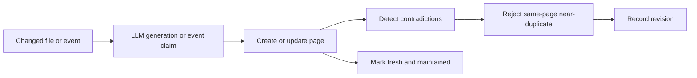

# Maintenance and integrity

Active contributors: Rom Iluz

## Purpose

The wiki engine can regenerate source-backed pages, promote event text into pages, detect contradictory claims, reject near-duplicates, and repair backlinks. These paths reuse page CRUD so normal schema, graph, and revision behavior still applies.

## Maintenance paths

### Git-diff maintenance

`detectChangedSources()` in `packages/wiki-engine/src/wiki-maintenance.ts` hashes source content with a truncated SHA-256 value and compares it with the tracked page's frontmatter maintenance hash. `runGitDiffMaintenance()` converts a changed source path to a `sources/...` slug, sends the source and current page state to a supplied LLM function, then creates or updates the page.

For updates, only generated new claims are sent to `updateWikiPage()`, which preserves existing claims and runs each candidate through the shared gate. The maintenance path then records `lastMaintainedAt`, source `git-diff`, and freshness `fresh`.

### Dreamer promotion

`runDreamerPromotion()` in `packages/wiki-engine/src/wiki-maintenance.ts` processes non-empty events one at a time. It searches for one semantically related page and falls back to an event-derived slug when search is unavailable. It adds the event text as a claim with confidence `0.7`, creates an entity page if necessary, and marks the page as maintained by `dreamer`.

The current implementation calls this a five-phase flow, but entity extraction and injection classification are minimal: each event becomes one claim, and classification is reduced to new versus update. The optional embedding callback is present in the API but is not used by the current function.

## Claim integrity

`runWritePipelineGate()` in `packages/wiki-engine/src/wiki-contradictions.ts` preserves one ordering rule: contradiction detection runs before deduplication. A near-duplicate write can therefore still expose a contradiction before it is rejected.

Contradiction detection is heuristic. It checks claims on directly related pages, requires word-level Jaccard overlap of at least `0.3`, and treats opposite negation polarity as contradictory. It records an unresolved contradiction on the related page. Deduplication checks only existing claims on the same page and uses an overlap threshold of `0.8`.

`listUnresolvedContradictions()` powers wiki lint output, and `resolveContradiction()` records one of `unresolved`, `newest_wins`, `authority_wins`, or `human_escalation` with resolver metadata. `countSupersededClaims()` in `packages/wiki-engine/src/wiki-governance.ts` provides a scope-level audit count.

## Graph and content integrity

`packages/wiki-engine/src/wiki-backlinks.ts` incrementally recomputes affected backlinks after relationship changes. `recomputeAllBacklinks()` repairs a whole scope after migration or data correction. Superseded pages do not contribute backlinks.

`packages/wiki-engine/src/wiki-transclusion.ts` reduces copy drift by resolving shared page content at render time. Its governance checks, cycle detection, and depth limit prevent transclusion from becoming either an access bypass or an unbounded recursion path.

The wiki map helper in `packages/wiki-engine/src/wiki-map-pointer.ts` generates an idempotent marked block for `AGENTS.md`, `CLAUDE.md`, or another Markdown file. It replaces a valid existing block, repairs an orphaned start marker, and preserves unrelated content.

## Operational limits

`MaintenanceResult` has counters for rejected claims and detected contradictions, but the current maintenance functions do not populate those counters from bridge gate results. Errors are collected per source or event so later items continue. Search unavailability does not stop Dreamer promotion because it falls back to an event slug.

## Integration points

Maintenance calls the same write path documented in [Pages and history](pages-and-history.md). Search-based matching and scope constraints are described in [Search and governance](search-and-governance.md). Repository and note-source adapters are covered in [OKF and connectors](okf-and-connectors.md). The [Features](../../features/index.md) section describes the user-facing workflows.

## Entry points for modification

Start in `packages/wiki-engine/src/wiki-maintenance.ts` for source detection or promotion behavior. Change claim heuristics and pipeline ordering in `packages/wiki-engine/src/wiki-contradictions.ts`. Use `packages/wiki-engine/src/wiki-backlinks.ts`, `packages/wiki-engine/src/wiki-transclusion.ts`, or `packages/wiki-engine/src/wiki-map-pointer.ts` for the corresponding repair and anti-drift mechanisms.

## Key source files

| File | Purpose |
| --- | --- |
| `packages/wiki-engine/src/wiki-maintenance.ts` | Git-diff regeneration and Dreamer event promotion |
| `packages/wiki-engine/src/wiki-contradictions.ts` | Contradiction detection, deduplication, lint, and resolution |
| `packages/wiki-engine/src/wiki-backlinks.ts` | Incremental and full backlink repair |
| `packages/wiki-engine/src/wiki-transclusion.ts` | Governed live content inclusion |
| `packages/wiki-engine/src/wiki-map-pointer.ts` | Repository map block generation and file injection |
| `packages/wiki-engine/src/wiki-bridge.ts` | Shared write path used by maintenance |
