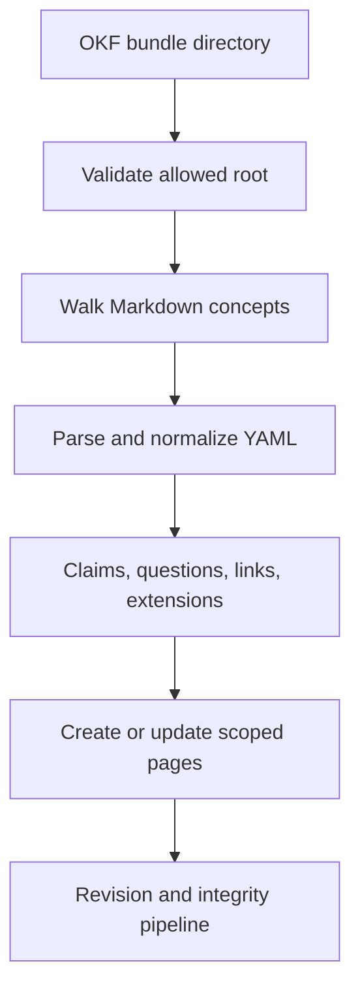

# OKF and connectors

Active contributors: Rom Iluz

## Purpose

The wiki engine imports and exports Open Knowledge Format v0.2 bundles and defines a common interface for external knowledge sources. `packages/wiki-engine/src/okf.ts` handles portable Markdown bundles. `packages/wiki-engine/src/wiki-connectors.ts` contains local, repository, and enterprise connector classes at different implementation stages.

## OKF projection

An OKF concept is a Markdown file whose path without `.md` becomes the concept ID and wiki slug. YAML frontmatter requires `type`; title, description, resource, tags, timestamp, provenance, verification, staleness, and sources are optional. MDBrain's page model is a strict superset, so embeddings, backlinks, `trustTier`, and permissions remain MongoDB-only.

OKF v0.2 trust and provenance vocabulary is preserved during import and export:

- `status`: `draft`, `stable`, or `deprecated`;
- `generated`: one actor event;
- `verified`: normalized to an array of actor events;
- `stale_after`: a date-only string;
- `sources`: source references and usage metadata.

These fields round-trip, but they are **not mapped to MDBrain `trustTier`**. Actor strings such as `human:<id>` remain OKF provenance. Assigning `restricted`, `standard`, or `admin` is a separate policy decision.

## Import flow

`importOkfBundle()` in `packages/wiki-engine/src/okf.ts` rejects parent traversal and, by default, requires `MDBRAIN_OKF_ALLOWED_ROOTS`. `MDBRAIN_OKF_ALLOW_UNRESTRICTED=true` is an explicit local-development escape hatch. Imports cap each concept at 1 MiB, frontmatter at 256 KiB, a bundle at 10,000 files, and cumulative input at 200 MiB.

The importer:

- skips reserved `index.md` and `log.md`;
- reports malformed or missing frontmatter instead of silently dropping it;
- normalizes YAML-parsed dates back to strings where OKF requires strings;
- preserves unknown extension keys, while rejecting keys starting with `$` or containing `.`;
- extracts claims and questions from conventional sections;
- derives relationships from inline, reference-style, and legacy wiki links;
- refuses to overwrite a manually authored page on slug collision;
- uses a caller session, creates a transaction when the handle has a client, or runs without a transaction for bare handles.

## Export flow

`exportOkfBundle()` requires a `GovernanceContext`, paginates all pages in the requested scope, filters them as a governed read, and writes contained concept files plus `index.md`. `returnContent` also returns file bodies to remote HTTP or MCP callers that cannot access the server filesystem.

Exports use standard bundle-root-relative Markdown links. Legacy `[[wikilink]]` syntax is accepted only on import. Claims, contradictions, questions, relationships, and person-card data are projected into Markdown sections.

## Connector contract

`SourceConnector` in `packages/wiki-engine/src/wiki-connectors.ts` defines `authenticate`, `discover`, `ingest`, and `mapPermissions`. `ConnectorRegistry` stores implementations by name.

| Connector | Current behavior |
| --- | --- |
| Obsidian | Verifies a local vault, discovers changed Markdown files, watches with debounce, maps to internal privacy, and can write contained page files back to the vault. Its `ingest` method does not yet create or update wiki pages. |
| GitHub | Validates token presence and maps repository visibility. Discovery returns no sources and ingestion does not write pages; callers must supply repository retrieval and maintenance orchestration. |
| Confluence | Validates credentials and maps space restrictions. Discovery and ingestion are stubs. |
| Notion | Validates an integration token and maps sharing metadata. Discovery and ingestion are stubs. |
| Slack | Validates a bot-token shape and maps private channels. Discovery and ingestion are stubs. |
| CRM | Validates Salesforce or HubSpot credentials and maps ownership. Discovery and ingestion are stubs. |

The enterprise connectors are **read-first stubs**, not production synchronization implementations. Confluence, Notion, Slack, and CRM contain configuration, authentication checks, cursor shapes, and permission mapping, but no outbound API calls or wiki writes. GitHub is similarly skeletal. Do not describe registration as a completed ingestion pipeline.

## Integration points

OKF upserts use [Pages and history](pages-and-history.md), exports use [Search and governance](search-and-governance.md), and source regeneration can feed [Maintenance and integrity](maintenance-and-integrity.md). The filesystem and principal trust boundaries are covered by [Security](../../security.md). HTTP endpoints live in the [API app](../../apps/api.md).

## Entry points for modification

Change parsing, projection, containment, or serialization in `packages/wiki-engine/src/okf.ts` and `packages/wiki-engine/src/filesystem-containment.ts`. Implement real source access and ingestion in `packages/wiki-engine/src/wiki-connectors.ts`, keeping permission mapping explicit and routing page writes through the bridge.

## Key source files

| File | Purpose |
| --- | --- |
| `packages/wiki-engine/src/okf.ts` | OKF parsing, validation, import, projection, and export |
| `packages/wiki-engine/src/filesystem-containment.ts` | Contained file-write enforcement |
| `packages/wiki-engine/src/wiki-connectors.ts` | Connector interface, implementations, and registry |
| `packages/wiki-engine/src/wiki-bridge.ts` | Page upsert operations used by OKF import |
| `packages/wiki-engine/src/wiki-governance.ts` | Export visibility filtering |
| `apps/api/src/routes/v1.ts` | Transactional OKF import and governed export routes |
