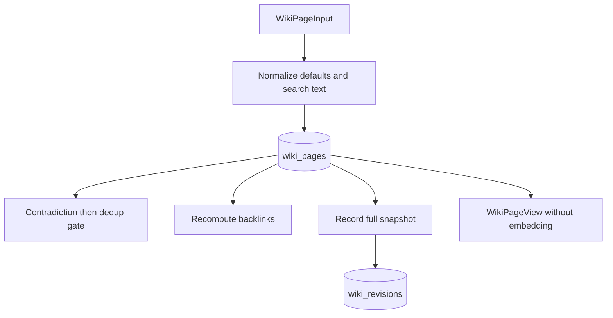

# Pages and history

Active contributors: Rom Iluz

## Purpose

The page layer maintains the current wiki view and a revision trail. `packages/wiki-engine/src/wiki-bridge.ts` implements CRUD, normalizes page data, updates derived graph fields, and returns views without raw embeddings. `packages/wiki-engine/src/wiki-revisions.ts` stores full snapshots for later inspection.

## Page write flow

Create initializes arrays, state `active`, revision `1`, freshness `fresh`, validity and audit timestamps, `text`, and transclusion targets. A caller-provided embedding function can add an explicit vector, but Atlas can also auto-embed the `text` field defined in `packages/wiki-engine/src/wiki-schema.ts`.

Update merges supported fields, recomputes `text` when title, summary, or body changes, increments the revision, and appends accepted claims without dropping existing claims. Passing an empty claims array explicitly clears claims. The claim gate in `packages/wiki-engine/src/wiki-contradictions.ts` checks cross-page contradictions before same-page near-duplicate rejection.

Delete is soft by default. It marks the page `superseded`, sets `validTo`, and increments the revision. Hard delete removes the current document but still records the previous content as a delete revision when snapshot recording succeeds.

## Reads and rendering

`getWikiPage()` and `listWikiPages()` in `packages/wiki-engine/src/wiki-bridge.ts` accept an optional `GovernanceContext`. Normal lists exclude superseded pages unless `state: "all"` is requested. API callers receive governed reads because `apps/api/src/routes/v1.ts` constructs the context from the authenticated principal.

`packages/wiki-engine/src/wiki-renderer.ts` emits dense Markdown for agents or a small dependency-free HTML article for humans. HTML rendering escapes page text before applying its limited heading, list, emphasis, code, and wiki-link transformations.

## Relationships, backlinks, and transclusion

Outgoing relationships are authored on a page. `packages/wiki-engine/src/wiki-backlinks.ts` derives incoming `backlinks` within the same scope after create, relationship update, or delete. `recomputeAllBacklinks()` is the repair and backfill path.

Page bodies can contain `{{page:slug}}` or `{{page:slug#Section}}`. `packages/wiki-engine/src/wiki-transclusion.ts` records unique targets on write and resolves content only when requested. Resolution:

- fetches every target through the same governance context;
- supports nested transclusions to a maximum depth of five;
- detects circular references;
- replaces missing, inaccessible, circular, or too-deep references with HTML comments instead of failing the whole render.

The API exposes raw markers by default and resolves them only for `GET /v1/wiki/*?transclude=true` in `apps/api/src/routes/v1.ts`.

## Revision history

Each revision record includes page identity, revision number, edit kind, optional editor, a full page snapshot, and creation time. `recordWikiPageRevision()` strips the embedding because vectors are large and do not help content history.

Without a transaction, snapshot insertion is best-effort and logs a failure. With a session, callers use strict mode so a revision failure aborts the surrounding transaction. Revision listing omits snapshots and caps results at 200; fetching one revision returns its full snapshot. Both paths can require current governed access, so history does not become a side channel to restricted content.

## Mutation evidence

`packages/wiki-engine/src/wiki-mutation-intents.ts` canonicalizes mutation payloads, computes a SHA-256 fingerprint, and inserts a `recorded` intent keyed by operation ID. The [API app](../../apps/api.md) records this intent in the same transaction as create, update, delete, and OKF import. The bridge itself does not automatically create mutation intents for direct library callers.

## Integration points

Search returns `WikiPageView` values as described in [Search and governance](search-and-governance.md). Maintenance calls the same CRUD functions rather than bypassing page rules; see [Maintenance and integrity](maintenance-and-integrity.md). User-facing wiki behavior is grouped under [Features](../../features/index.md).

## Entry points for modification

Change page shape and CRUD behavior in `packages/wiki-engine/src/wiki-bridge.ts`. Change presentation in `packages/wiki-engine/src/wiki-renderer.ts`, history semantics in `packages/wiki-engine/src/wiki-revisions.ts`, backlinks in `packages/wiki-engine/src/wiki-backlinks.ts`, and live inclusion rules in `packages/wiki-engine/src/wiki-transclusion.ts`.

## Key source files

| File | Purpose |
| --- | --- |
| `packages/wiki-engine/src/wiki-bridge.ts` | CRUD, input normalization, derived updates, and page views |
| `packages/wiki-engine/src/wiki-revisions.ts` | Revision recording, summaries, and snapshot reads |
| `packages/wiki-engine/src/wiki-renderer.ts` | Markdown and HTML page rendering |
| `packages/wiki-engine/src/wiki-backlinks.ts` | Incremental and full backlink recomputation |
| `packages/wiki-engine/src/wiki-transclusion.ts` | Marker extraction and governed recursive resolution |
| `packages/wiki-engine/src/wiki-mutation-intents.ts` | Fingerprinted mutation audit records |
| `apps/api/src/routes/v1.ts` | HTTP page, revision, rendering, and mutation-intent orchestration |
