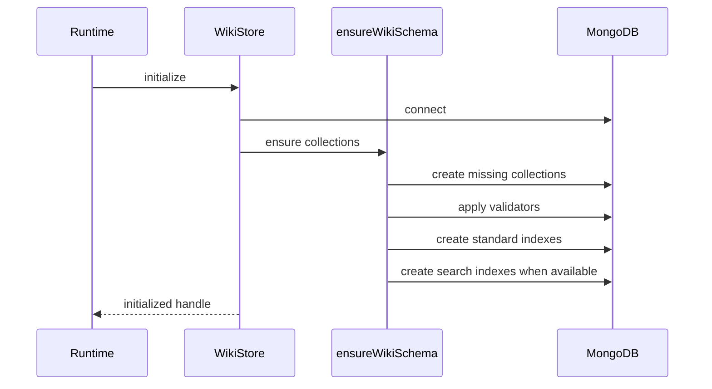

# Schema and storage

Active contributors: Rom Iluz

## Purpose

The wiki engine stores current pages, immutable revision snapshots, wiki mutation audit records, and durable memory-delivery records in four MongoDB collections. `packages/wiki-engine/src/wiki-schema.ts` defines their validators and indexes, while `packages/wiki-engine/src/wiki-store.ts` owns connection and transaction setup.

## Collections

The configured prefix is prepended to every base name. With the default `mdbrain_` prefix, the collections are `mdbrain_wiki_pages`, `mdbrain_wiki_revisions`, `mdbrain_wiki_mutation_intents`, and `mdbrain_memory_delivery_intents`.

| Base collection | Stored data | Primary identity |
| --- | --- | --- |
| `wiki_pages` | Current page content, claims, graph fields, governance metadata, and search text | `slug + scope + scopeRef` |
| `wiki_revisions` | Full page snapshot for each create, update, or delete | `pageSlug + scope + scopeRef + revision` |
| `wiki_mutation_intents` | Fingerprinted API mutation evidence | `operationId` |
| `memory_delivery_intents` | Memory dispatch, reconciliation, and promotion state | `operationId` |

## Page document

`WikiPageInput` in `packages/wiki-engine/src/wiki-bridge.ts` accepts six page kinds: `entity`, `concept`, `synthesis`, `source`, `report`, and `procedure`. Every persisted page has a title, slug, summary, body, OKF-compatible frontmatter, scope, concrete `scopeRef`, trust tier, lifecycle state, revision, validity start, freshness, and timestamps.

Optional structures add:

- claims with status, evidence, writer provenance, derivation, and validity;
- unresolved or resolved contradictions between claim IDs;
- open questions and the claim that answered them;
- outgoing relationships plus computed backlinks and transclusion targets;
- person-card fields for entity pages;
- OKF bundle and concept IDs;
- permissions for subjects, groups, roles, departments, and privacy tier;
- a `text` field containing title, summary, and body for Atlas auto-embedding.

`packages/wiki-engine/src/wiki-bridge.ts` deliberately adds optional fields only when they have values. Persisting an optional property as `undefined` can fail MongoDB `$jsonSchema` validation.

## Schema initialization

`ensureWikiSchema()` in `packages/wiki-engine/src/wiki-schema.ts` runs the four setup phases in order. Validators use `validationLevel: "moderate"` and `validationAction: "error"`. Search-index creation is skipped, with logging, when Atlas Search or `mongot` is unavailable; collection and standard index setup still proceeds.

## Index strategy

`wiki_pages` has a unique scoped-slug index and indexes for kind, graph IDs, OKF IDs, scope, trust tier, state, freshness, tags, aliases, update time, and maintenance time. Its search definitions are:

- `wiki_pages_vector`, an `autoEmbed` vector index over `text` using `voyage-4-large`, with governance-related filter fields;
- `wiki_pages_text`, an Atlas Search index over title, summary, body, aliases, and tags, with token fields for filtering.

The other collections use unique operation or revision indexes and state/time indexes for reconciliation. `memory_delivery_intents` also has a scope and creation-time index.

## Store lifecycle and transactions

`resolveWikiStoreConfig()` in `packages/wiki-engine/src/wiki-store.ts` requires `MDBRAIN_WIKI_MONGODB_URI`; the database and prefix default to `mdbrain_wiki` and `mdbrain_`. Concurrent calls to `WikiStore.initialize()` share one initialization promise. `handle()` fails before initialization, `transaction()` uses a MongoDB client session and `withTransaction()`, and `close()` closes the client.

The [API app](../../apps/api.md) keeps this store behind its runtime adapter. Direct package users must initialize the store before requesting a handle and need a replica set or compatible deployment for transactional paths.

## Integration points

- [Pages and history](pages-and-history.md) writes current pages and revision snapshots.
- [Search and governance](search-and-governance.md) consumes both standard fields and Atlas search indexes.
- [Delivery intents](delivery-intents.md) uses the delivery collection as an outbox-style ledger.
- [Security](../../security.md) explains why scope and permission metadata must be supplied by trusted server code.

## Entry points for modification

Change validators and index targets in `packages/wiki-engine/src/wiki-schema.ts`. Change environment resolution, initialization, or transaction behavior in `packages/wiki-engine/src/wiki-store.ts`. A schema change should include validation and persistence tests in `packages/wiki-engine/src/wiki-schema.test.ts` and the affected module test.

## Key source files

| File | Purpose |
| --- | --- |
| `packages/wiki-engine/src/wiki-schema.ts` | Collection helpers, JSON schemas, indexes, and setup sequence |
| `packages/wiki-engine/src/wiki-store.ts` | MongoDB connection, initialization, handles, and transactions |
| `packages/wiki-engine/src/wiki-bridge.ts` | Page input normalization and persisted defaults |
| `packages/wiki-engine/src/wiki-revisions.ts` | Revision record shape and collection access |
| `packages/wiki-engine/src/wiki-mutation-intents.ts` | Mutation fingerprint and audit record |
| `packages/wiki-engine/src/memory-delivery.ts` | Delivery record shape and state transitions |
