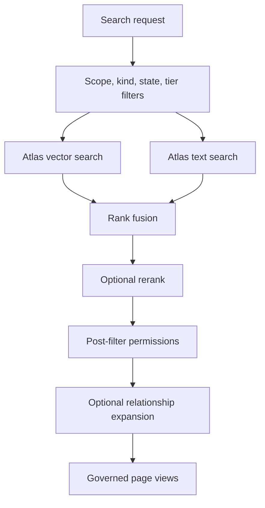

# Search and governance

Active contributors: Rom Iluz

## Purpose

Wiki retrieval combines Atlas vector and full-text search with strict scope and permission checks. `packages/wiki-engine/src/wiki-search.ts` builds retrieval pipelines, and `packages/wiki-engine/src/wiki-governance.ts` provides the reusable read filters used by search, direct reads, graph traversal, revision access, transclusion, and OKF export.

## Retrieval recipes

| Recipe | Mode | Candidate multiplier | Intended tradeoff |
| --- | --- | ---: | --- |
| `fast` | Vector only | 10 | Lower candidate count |
| `hybrid` | Vector plus text | 20 | Default reciprocal-rank fusion |
| `deep` | Vector plus text | 40 | Larger candidate pool |

Vector search uses Atlas auto-embedding with `voyage-4-large`. Text search covers title, summary, body, aliases, and frontmatter tags. Hybrid mode combines the two pipelines with `$rankFusion`. An optional native `$rerank` stage uses `rerank-2.5`; if that stage is unsupported, the engine retries without it. A caller can instead provide an application-side rerank function.

`WikiSearchParams.minScore` is accepted and copied into recipe configuration, but `packages/wiki-engine/src/wiki-search.ts` does not currently filter returned documents by that value. Treat it as an incomplete extension point rather than an enforced threshold.

## Search flow

The default state filter excludes superseded pages. When search indexes are unavailable, search returns an empty result rather than falling back to a collection scan. Optional graph expansion traverses `relationships.targetPageSlug` with `$graphLookup`, caps expansion at 20 pages, and applies governance again before merging graph results.

## Governance model

`GovernanceContext` contains:

- required `scope`, `scopeRef`, and requester `trustTier`;
- optional stable subject ID and namespaced external groups;
- roles and departments;
- capabilities and agent ID for higher layers.

`buildScopeFilter()` always returns exact scope and `scopeRef` equality. The accepted `crossScope` option does not currently relax that filter. `canPropagateCrossScope()` expresses a trust-tier propagation policy, but current governed read functions do not use it to bypass exact scope matching.

For non-admin readers, a page is visible when it has no restrictive permission fields, is public or internal, or explicitly matches one of the requester's subjects, groups, roles, or departments. Admin bypasses the permission predicate but still remains in the requested scope. `filterPagesByGovernance()` applies the equivalent rules to materialized documents.

## Enforcement locations

- `getWikiPageGoverned()` and `getWikiPageByIdGoverned()` apply filters in MongoDB.
- `graphTraversalGoverned()` performs bounded breadth-first traversal and fetches each page through the governance filter.
- `searchWikiPages()` prefilters indexed fields, then post-filters identity and organization permissions.
- `packages/wiki-engine/src/wiki-revisions.ts` first checks access to the live page, then checks a fetched snapshot.
- `packages/wiki-engine/src/wiki-transclusion.ts` resolves every embedded page through governed lookup.
- `packages/wiki-engine/src/okf.ts` requires a governance context and filters every exported page.

The API derives governance fields from `ApiPrincipal` in `apps/api/src/routes/v1.ts`; clients do not get to declare their own roles or departments. See [Security](../../security.md) for authentication and capability boundaries.

## Integration points

Index definitions and filterable fields are documented in [Schema and storage](schema-and-storage.md). Relationship expansion uses graph fields maintained by [Pages and history](pages-and-history.md). API request and response details belong to the [API app](../../apps/api.md) and [API reference](../../api/index.md).

## Entry points for modification

Change recipes, aggregation stages, or result expansion in `packages/wiki-engine/src/wiki-search.ts`. Change scope and permission semantics centrally in `packages/wiki-engine/src/wiki-governance.ts`; then verify every read path and its tests because partial enforcement can disclose restricted content.

## Key source files

| File | Purpose |
| --- | --- |
| `packages/wiki-engine/src/wiki-search.ts` | Recipe defaults, Atlas pipelines, reranking, and graph expansion |
| `packages/wiki-engine/src/wiki-governance.ts` | Scope, permission, propagation, and governed read helpers |
| `packages/wiki-engine/src/wiki-schema.ts` | Atlas vector and text index definitions |
| `packages/wiki-engine/src/wiki-revisions.ts` | Governed revision reads |
| `packages/wiki-engine/src/wiki-transclusion.ts` | Governed transclusion lookup |
| `packages/wiki-engine/src/okf.ts` | Governed OKF export |
| `apps/api/src/routes/v1.ts` | Principal-to-governance context mapping |
