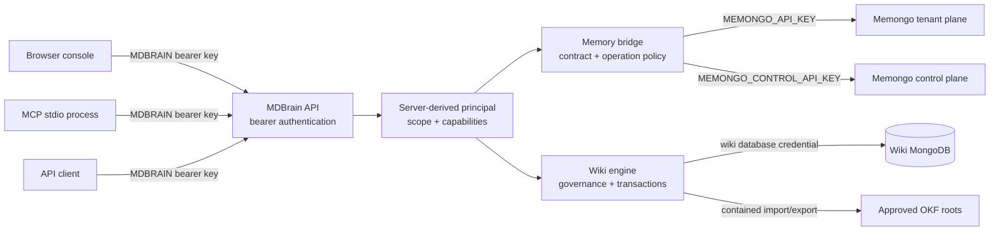
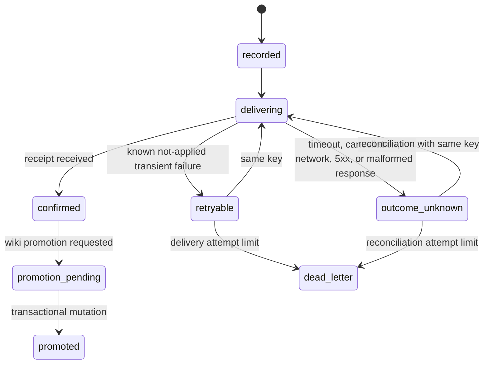

# Security

MDBrain's security model has four principal boundaries: callers authenticate to the MDBrain API, the API uses separate credentials for Memongo and the wiki database, governance filters every wiki read, and filesystem operations are restricted to configured roots. Security depends on preserving those boundaries during deployment.

## Trust boundaries



Never expose `MEMONGO_API_KEY`, `MEMONGO_CONTROL_API_KEY`, or `MDBRAIN_WIKI_MONGODB_URI` to clients. The browser and MCP process call MDBrain with an MDBrain bearer key; only the API crosses the Memongo and wiki storage boundaries.

## Bearer principals and capabilities

`apps/api/src/app.ts` protects `/v1/*` with bearer authentication when either `MDBRAIN_API_KEY` or `MDBRAIN_API_SCOPED_KEYS` is configured. `apps/api/src/principal.ts` compares bearer values through SHA-256 digests and `timingSafeEqual`.

`MDBRAIN_API_KEY` resolves to an unrestricted administrator principal with every capability:

| Capability | Authority |
| --- | --- |
| `read` | Read routes, including POST-based search and context operations |
| `write` | Memory writes, lifecycle updates, wiki writes, and soft mutations |
| `administer` | `/v1/admin/*` and otherwise-unclassified operations |
| `change-permissions` | Wiki trust-tier or permissions changes; checked again in wiki mutation handlers |
| `hard-delete` | Lifecycle deletion and wiki requests using `hard=true` |
| `export` | OKF export |
| `manage-connectors` | Reserved in the principal model; no connector-management HTTP route is currently implemented |

Use `MDBRAIN_API_SCOPED_KEYS` for tenant and agent credentials. It accepts a JSON array or object. Each policy must contain a token and constrain at least one of `agentIds`, `scopes`, or `scopeRefs`; omitted dimensions become wildcards.

```json
[
  {
    "token": "replace-with-a-secret",
    "subjectId": "service:research-agent",
    "agentIds": ["research-agent"],
    "scopes": ["workspace"],
    "scopeRefs": ["workspace-42"],
    "groups": ["team:research"],
    "roles": ["editor"],
    "departments": ["research"],
    "trustTier": "standard",
    "capabilities": ["read", "write"],
    "membershipValidUntil": "2027-01-01T00:00:00Z"
  }
]
```

Scoped policies default to `read` and `write` capabilities and `standard` trust. Group identifiers must be namespaced with `:`. Duplicate subject IDs, invalid scopes or capabilities, empty policies, expired membership, and inactive principals fail authorization.

The middleware extracts `agentId`, `scope`, and `scopeRef` from query parameters and known request-body containers. Conflicting values are rejected. A request must fit one allowed agent and one allowed scope/scope-ref pair; request fields can narrow authority but cannot add authority. The authenticated principal supplies subject, groups, roles, departments, trust tier, and capabilities to wiki governance.

If neither API key setting is present, production mode refuses to start. Development mode creates an unauthenticated in-process principal and logs a warning. Do not expose that mode to a network.

## Scope and wiki governance

`packages/wiki-engine/src/wiki-governance.ts` applies an exact `scope` and `scopeRef` filter to governed get, search, graph traversal, and OKF export paths. Even an administrator does not bypass the scope pair in the current implementation.

Within that scope, non-admin callers can read a page when it has no restrictive permissions, is marked `public` or `internal`, or explicitly matches the principal's subject, namespaced group, role, or department. Administrators bypass the page permissions filter but still remain inside the requested scope.

Wiki writes run with a governance context built from the authenticated principal in `apps/api/src/routes/v1.ts`. Changing `trustTier` or `permissions` requires `change-permissions` in addition to the route's normal write capability. Mutation intent and revision records preserve who changed a page and why.

Treat scope and permission checks as complementary:

- API scope grants limit which namespace a key may request.
- Wiki governance limits which documents inside that namespace are visible.
- Capabilities limit which operation the principal may perform.
- Trust tier and page permissions control sensitive wiki visibility and propagation decisions.

## Contract and transport boundary

`packages/memory-bridge/src/memongo-runtime.ts` pins Memongo API version `2.0.1` and canonical OpenAPI SHA-256 `01680e7ba03674ae06c899856d7521e95e66d5d1be465f172080907dc29cb8bc`. `packages/memory-bridge/src/memongo-http-client.ts` fetches `/openapi.json`, canonicalizes it, and rejects the service unless both version and digest match. Compatibility is rechecked after `MEMONGO_COMPATIBILITY_TTL_MS`, which defaults to 60 seconds.

The accepted evidence lives in:

- `docs/contracts/memongo/2.0.1/openapi.json`
- `docs/contracts/memongo/2.0.1/capture.json`
- `scripts/capture-memongo-contract.ts`

The capture script is read-only against Memongo and refuses to overwrite existing evidence. Updating the pin requires a reviewed new capture and matching gateway validators; a matching version string alone is insufficient.

The Memongo base URL cannot contain credentials. HTTPS is required except for explicit loopback development with `MEMONGO_ALLOW_INSECURE_LOCAL=1`, and redirects are rejected. Every retained response is checked by the validators in `packages/memory-bridge/src/memongo-gateway-contract.ts` before it reaches the API.

## Tenant and control credentials

`packages/memory-bridge/src/memongo-operation-policy.ts` assigns every upstream operation to a credential lane:

- Tenant reads and writes use `MEMONGO_API_KEY`.
- `status`, `embeddingProbe`, and `vectorProbe` use `MEMONGO_CONTROL_API_KEY`.
- A missing control key fails closed for a control operation; the tenant key is never substituted.

Control probes are not public MDBrain product routes. `GET /ready` invokes them only when `MEMONGO_READINESS_CONTROL_LANES` explicitly lists `control`, `embedding`, or `vector`. Keep the control credential more restricted and separately rotatable from the tenant credential.

The wiki database credential is another independent secret. MDBrain owns only wiki collections through `MDBRAIN_WIKI_MONGODB_URI`; it must not receive credentials for Memongo-owned collections.

## Idempotency and ambiguous outcomes

`POST /v1/add` and `POST /v1/write-event` require caller-owned idempotency keys. The API derives a delivery operation ID from the principal subject, scope, scope reference, operation, and key, then records a canonical payload fingerprint in the wiki database before dispatch.

An exact replay returns the persisted receipt. Reusing the same operation identity with a different payload, principal, scope, operation, or promotion policy records the conflicting fields and returns a conflict. Memongo receives the original idempotency key.

Writes are never assumed to have failed after an ambiguous network result:



`packages/memory-bridge/src/memongo-http-client.ts` does not run an implicit retry loop. It classifies `retryable`, `retryAfterMs`, and `outcome`. `apps/api/src/memory-delivery-runtime.ts` persists the state and its reconciler retries eligible deliveries with the same key. An upstream timeout remains `outcome-unknown`, not `not-applied`.

Other Memongo writes are classified as non-retryable unless the operation policy explicitly provides idempotency. The bridge rejects an idempotency header on operations that do not accept one. Do not add generic retries around those writes.

Wiki promotion is opt-in and receipt-gated. The API does not create the wiki page until Memongo returns a receipt, and the page mutation plus promotion state change share a wiki transaction.

## SSRF and outbound requests

`packages/lib/src/ssrf.ts` provides reusable guards that block known local hostnames, private IPv4 and IPv6 ranges, link-local addresses, and hostnames that resolve to private addresses unless policy explicitly permits them. Hostname allowlists can permit exact names or wildcard subdomains.

This guard is not currently wired into an in-repository outbound connector. The connector classes in `packages/wiki-engine/src/wiki-connectors.ts` are discovery and permission-mapping scaffolds; their enterprise and GitHub `discover` methods do not make network requests. Any implementation that adds user-configurable connector URLs must call the SSRF guard before connection and after DNS resolution, constrain redirects, and test private-address rejection.

The Memongo transport has its own narrower URL policy in `packages/memory-bridge/src/memongo-http-client.ts`: HTTPS is mandatory outside explicit loopback development, URL credentials are rejected, and redirects fail. Do not mistake the unused general SSRF utility for application-wide outbound filtering.

## Filesystem containment

OKF import and export fail closed unless `MDBRAIN_OKF_ALLOWED_ROOTS` contains an approved root. `MDBRAIN_OKF_ALLOW_UNRESTRICTED=true` bypasses that default only as an explicit local-development option and must not be used in production.

`packages/wiki-engine/src/okf.ts` rejects parent traversal and resolves the requested directory against the configured roots. `packages/wiki-engine/src/filesystem-containment.ts` adds export protections:

- Reject absolute, drive-qualified, backslash-separated, and `..` file names.
- Validate all targets before writing any content.
- Resolve existing ancestors and ensure they remain inside the real export root.
- Reject symlink targets and recheck containment after writing.

`ObsidianConnector.exportToVault` in `packages/wiki-engine/src/wiki-connectors.ts` uses the same contained writer. Mount only the directories required for OKF or vault operations, and grant the API process no broader filesystem access than necessary.

## Secret handling and error output

`packages/lib/src/redact.ts` masks common key, token, password, bearer, private-key, and credential-bearing MongoDB URI patterns. `apps/api/src/lib/errors.ts` applies that redaction to JSON error messages before returning them to clients. Shared error formatting also uses the same redactor.

`GET /v1/admin/deliveries` requires `administer` and removes the persisted payload, idempotency key, payload fingerprint, and principal subject from its response. The full delivery intent remains in the wiki database because reconciliation needs it.

Redaction is pattern-based, not a general data-loss-prevention system. Do not put secrets in memory content, wiki pages, idempotency keys, request IDs, or arbitrary metadata. Keep environment secrets out of source, browser bundles, logs, proof artifacts, and package tarballs.

The web console in `apps/web/app/console/page.tsx` stores the entered MDBrain key in React state and sends it from the browser. It is not a server-side secret store. Prefer narrow, short-lived scoped keys for browser use.

## CORS and rate limiting

`apps/api/src/app.ts` applies CORS to all paths. Set `MDBRAIN_API_CORS_ORIGINS` to a comma-separated allowlist for a deployed browser console. If it is unset, the application invokes Hono's default CORS policy rather than a deployment-specific allowlist.

The API also applies a sliding-window limiter to `/v1/*`:

- `MDBRAIN_API_RATE_LIMIT_MAX` defaults to 100 requests.
- `MDBRAIN_API_RATE_LIMIT_WINDOW_MS` defaults to 60,000 ms.
- Setting the maximum to `0` disables the limiter.
- By default, identity comes from `X-Real-IP`, or all requests without it share `unknown`.
- `MDBRAIN_API_TRUST_PROXY=true` accepts the first `X-Forwarded-For` value.

Enable proxy trust only when a trusted ingress overwrites forwarding headers. The limiter is an in-memory, per-process control; it does not coordinate across replicas and is not a tenant quota. Use an ingress or external distributed limiter when a multi-instance deployment requires global enforcement.

## Transaction fail-closed behavior

`packages/wiki-engine/src/wiki-store.ts` wraps wiki mutations in MongoDB `withTransaction` and has no nontransactional fallback. `apps/api/src/wiki-store-runtime.ts` also opens a transaction during readiness. A standalone MongoDB server therefore fails readiness and cannot be treated as a degraded write mode.

Transactional operations include wiki page and revision changes, mutation intents, memory delivery state transitions, OKF import, and receipt-gated promotion. If transaction support is unavailable, the operation fails instead of partially applying the intended state. Use a replica set or sharded cluster for every API deployment.

## Publish provenance and supply chain

`.github/workflows/publish.yml` publishes the package cohort with `npm publish --access public --provenance`. The job grants `id-token: write` for provenance and reads the npm credential from `secrets.NPM_TOKEN`. It publishes packages in the order returned by `scripts/publish-package-cohort.ts` and skips an exact version already present in npm.

Before publish, `scripts/check-publishability.ts`:

- Requires package metadata and built `dist` entry points.
- Rejects source, tests, and `tsconfig.json` in package tarballs.
- Rejects private app dependencies and unresolved `workspace:` ranges.
- Requires exact versions for public sibling packages in the cohort.
- Installs the packed cohort without lifecycle scripts and imports each package.
- Verifies `.github/workflows/publish.yml` consumes the single authoritative cohort.

The check is not a general secret scanner. Review packed files and repository changes before tagging. Require the CI gates in `.github/workflows/ci.yml` on the exact release commit because the publish workflow runs build, tests, and publishability checks but does not run lint or type checking.

## Security deployment checklist

- Configure `MDBRAIN_API_KEY` or constrained `MDBRAIN_API_SCOPED_KEYS`; production startup must never use the development fallback.
- Give browser and MCP clients MDBrain credentials, never Memongo or MongoDB credentials.
- Keep Memongo tenant and control keys separate.
- Use HTTPS for Memongo and do not enable `MEMONGO_ALLOW_INSECURE_LOCAL` outside loopback development.
- Configure `MDBRAIN_API_CORS_ORIGINS` and validate trusted-proxy behavior.
- Use a transaction-capable wiki MongoDB deployment and gate traffic on `GET /ready`.
- Configure `MDBRAIN_OKF_ALLOWED_ROOTS` before enabling filesystem import or export.
- Preserve caller idempotency keys across retries and treat `outcome-unknown` as unresolved.
- Review a new Memongo contract capture before changing the pinned version or digest.
- Publish only from a reviewed release commit with successful CI and npm provenance.

See [Deployment](deployment/index.md) for runtime setup, [Architecture](overview/architecture.md) for the service topology, [API](apps/api.md) for middleware and route behavior, and [Memory bridge](packages/memory-bridge.md) for the upstream contract.
